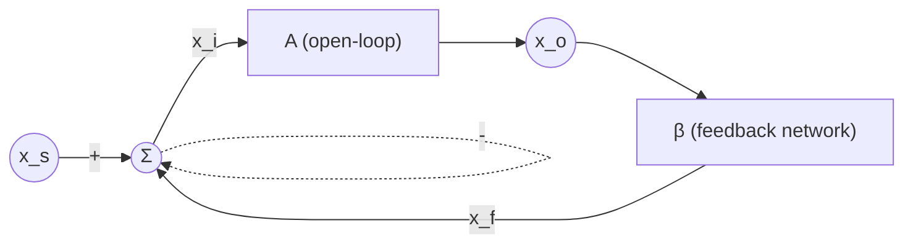
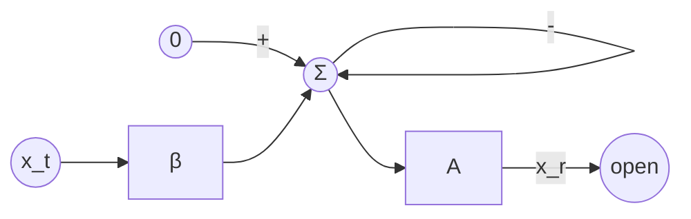
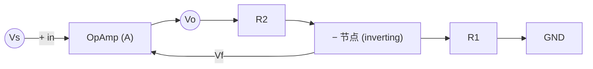
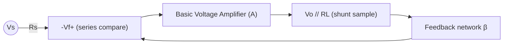

# EE115 Lecture15 — Feedback 基础与负反馈四大优势

<aside>
🔁

**本节主题：** Negative Feedback 的基本理论与系统级好处。

**教材：** Sedra/Smith *Microelectronic Circuits* — Ch.11, pp. **807–820**。

**核心脉络：**

1. 反馈的基本结构 → $A_f = \dfrac{A}{1+A\beta}$
2. Loop gain $A\beta$ 的物理意义与“断环测量”
3. 负反馈四大优势：**gain desensitivity / bandwidth extension / noise & interference reduction / nonlinear distortion reduction**
4. 电压放大器的反馈拓扑：**Series–Shunt**
</aside>

## 📅 课程行政信息

- [ ]  **Homework (TBD)** — Sedra/Smith Ch.11 习题（老师 slide 仍为 `chapter 9 problem xx` 占位，待补充准确题号 / 截止日期）。

<aside>
⚠️

Slide 16 上的 deadline 写的是 `May xxth 11p.m.`，老师没给出具体题号和日期。等课后老师在群里补发题目后再回来更新这条 to-do。

</aside>

## 1⃣ 为什么要用 Feedback？

Feedback（特别是 **negative feedback**）是模拟电路中实现“高精度信号处理”的核心技术。它把放大器从“一个看天吃饭的器件”变成“可设计、可预测的系统”。

负反馈带来的五大好处：

1. **Desensitize the gain** — 闭环增益对 $A$、温度、工艺漂移不敏感。
2. **Reduce nonlinear distortion** — 把非线性传输特性“拉直”。
3. **Reduce the effect of noise / interference** — 把信号源前置在干扰之前，提升 S/I。
4. **Control input/output resistances** — 不同拓扑可任意造出高/低 $R_{in}$、$R_{out}$。
5. **Extend the bandwidth** — 用增益换带宽（gain–bandwidth product 守恒）。

<aside>
🎯

**核心思想：用我们能造的“1+Aβ”，去对抗器件本身造不准的 A。**

所有好处都按 **同一个因子** $(1+A\beta)$ 缩放，这个因子被称为 **amount of feedback / desensitivity factor**。

</aside>

Slide 3 — Negative Feedback 五大优势 overview

## 2⃣ The General Feedback Structure

标准负反馈框图：

Slide 4 — The general feedback structure（block diagram + 闭环增益推导）

四个基本量：

- $A$：**open-loop gain**（基本放大器自身的增益）。
- $\beta$：**feedback factor**（反馈网络对输出取样并送回输入端的比例）。
- $A\beta$：**loop gain**（沿环路绕一圈的总增益）。
- $1+A\beta$：**amount of feedback / desensitivity factor**。

四个 KVL/KCL 方程（理想情况下反馈网络不 loading 主放大器）：

$$
x_o = A\,x_i,\qquad x_f = \beta\,x_o,\qquad x_i = x_s - x_f
$$

消去 $x_i, x_f$ 得到 **闭环增益 / closed-loop gain**：

$$
A_f \equiv \frac{x_o}{x_s} = \frac{A}{1 + A\beta}
$$

极限情况：当 $A\beta \gg 1$，

$$
A_f \;\simeq\; \frac{1}{\beta}
$$

<aside>
💡

**口诀：** 只要 loop gain 足够大，闭环增益由“**我们造的** $\beta$”决定，**与“器件本身不准的** $A$**” 几乎无关**。

</aside>

## 3⃣ Loop Gain $A\beta$ —— 怎么“量”出来

概念上，loop gain 是 **沿反馈环走一圈** 的电压（或电流）增益。 $A\beta$ 决定了三件事：

| 项目 | 含义 |
| --- | --- |
| **Sign of** $A\beta$ | 决定 polarity：$+$ → 正反馈（震荡）；$-$ → 负反馈（稳定） |
| \ | $A\beta$\ |
| $1+A\beta$ | 各项性能改善的倍数（desensitivity / 带宽 / 失真 / 干扰） |

### Break-the-loop method（断环测量法）

1. 把环路在某点断开（典型选基本放大器输出处）。
2. 输入端的 $x_s$ 置 0。
3. 在断点的右侧（看向反馈网络）注入测试信号 $x_t$。
4. 测量左侧返回的信号 $x_r$。

$$
x_r = -A\beta\,x_t \;\;\Longrightarrow\;\; A\beta = -\frac{x_r}{x_t}
$$

<aside>
⚠️

**断点处要保持原阻抗匹配**（用 $\langle\!\langle$ 表示阻抗终结），否则测出来的是带 loading 误差的 $A\beta$。

</aside>

Slide 5 — The loop gain + Fig. 11.2 断环测量法

## 4⃣ 工程例题：非反相运放（Non-Inverting Op-Amp）

经典 Series–Shunt 反馈电路：op-amp 作为 $A$，$R_1$ 和 $R_2$ 构成分压器作为 $\beta$。

Slide 6 — Non-inverting op-amp 例题：题面 (a)–(f)

### (a) 求反馈系数 $\beta$

假设 op-amp **输入阻抗 = ∞、输出阻抗 = 0**，则 $R_1, R_2$ 既不 load 输出，也不抽走输入电流。反馈网络是个纯分压器：

$$
\beta \equiv \frac{V_f}{V_o} = \frac{R_1}{R_1+R_2}
$$

相减由 op-amp 的**差分输入端**天然完成（$V_i = V_s - V_f$）。

### (b) 闭环增益 “几乎只取决于 $\beta$” 的条件

$$
A_f = \frac{A}{1+A\beta},\quad A\beta \gg 1 \;\Longrightarrow\; A_f \simeq \frac{1}{\beta} = 1 + \frac{R_2}{R_1}
$$

等价条件：$A \gg A_f$，即 **open-loop 增益要远大于希望的 closed-loop 增益**。

Slide 7 — (a)(b) 推导：β = R₁/(R₁+R₂) + 闭环增益条件 Aβ ≫ 1

### (c) 取 $A = 10^4$ V/V，要 $A_f = 10$ V/V

粗略：$\beta \simeq 1/A_f = 0.1$，于是

$$
\frac{1}{\beta} = 1+\frac{R_2}{R_1} = 10 \;\Longrightarrow\; \frac{R_2}{R_1} = 9
$$

精确解：

$$
10 = \frac{10^4}{1+10^4\beta} \;\Longrightarrow\; \beta = 0.0999,\quad \frac{R_2}{R_1} = 9.01
$$

粗、精两个结果差 ~0.1 %，完全够工程用。

Slide 8 — (c) 精确解：β = 0.0999, R₂/R₁ = 9.01

### (d) 反馈量（amount of feedback）

$$
1+A\beta = \frac{A}{A_f} = \frac{10^4}{10} = 10^3 \;\Longrightarrow\; 20\log_{10}(10^3) = 60\ \text{dB}
$$

### (e) $V_s = 1\,\text{V}$ 时

$$
V_o = A_f V_s = 10\ \text{V},\quad V_f = \beta V_o = 0.0999\times 10 = 0.999\ \text{V},\quad V_i = \frac{V_o}{A} = 10^{-3}\ \text{V}
$$

<aside>
📌

若用近似 $\beta = 0.1$，会算出 $V_f = 1\,\text{V}$, $V_i = 0$，这就是“virtual short / 虚短”假设：op-amp 两输入端电压相等。

</aside>

### (f) $A$ 下降 20% 时，$A_f$ 变化多少？

$$
A' = 0.8\times 10^4\ \text{V/V} \;\Longrightarrow\; A_f' = \frac{0.8\times10^4}{1+0.8\times10^4\times 0.0999} = 9.9975\ \text{V/V}
$$

即 $A_f$ 只降 0.025%，约 $1/(1+A\beta) = 1/1000$ 倍于 $A$ 的变化。**这就是 desensitivity 的力量**。

Slide 9 — (d)(e)(f) 推导：60 dB 反馈量 + Vo/Vf/Vi + 20% 灵敏度演示

## 5⃣ Feedback Gain Desensitivity

对 $A_f = A/(1+A\beta)$ 关于 $A$ 求微分：

$$
dA_f = \frac{dA}{(1+A\beta)^2}
$$

两边除以 $A_f$：

$$
\boxed{\;\frac{dA_f}{A_f} = \frac{1}{1+A\beta}\cdot\frac{dA}{A}\;}
$$

<aside>
🎯

**结论：** $A_f$ 的相对漂移 = $A$ 的相对漂移 / $(1+A\beta)$。

这就是为什么 $1+A\beta$ 叫 **desensitivity factor**——它直接量化了“反馈对参数漂移的免疫能力”。

</aside>

Slide 10 — Feedback gain desensitivity 推导：dAf/Af = (dA/A)/(1+Aβ)

## 6⃣ Feedback Bandwidth Extension

假设主放大器是单极点系统：

$$
A(s) = \frac{A_M}{1+s/\omega_H}
$$

带反馈后：

$$
A_f(s) = \frac{A(s)}{1+\beta A(s)} = \frac{A_M/(1+A_M\beta)}{1+\dfrac{s}{\omega_H(1+A_M\beta)}}
$$

即闭环系统仍是单极点系统，但：

| 量 | 开环 | 闭环 |
| --- | --- | --- |
| Midband gain | $A_M$ | $A_{Mf} = A_M/(1+A_M\beta)$ |
| 高 3dB 频率 | $\omega_H$ | $\omega_{Hf} = \omega_H(1+A_M\beta)$ |
| 低 3dB 频率（若有） | $\omega_L$ | $\omega_{Lf} = \omega_L/(1+A_M\beta)$ |

增益减小、带宽增大，**两者乘积守恒**：

$$
A_{Mf}\cdot\omega_{Hf} = A_M\cdot\omega_H = \text{const.} \;\;(\text{Gain-Bandwidth Product})
$$

Slide 11 — Fig. 11.4：负反馈把 midband gain 降 $(1+A_M\beta)$ 倍、$f_H$ 升 $(1+A_M\beta)$ 倍，Bode 矩形面积守恒

<aside>
🎯

**口诀：** 负反馈“**用增益换带宽**”，$A$ 降多少倍， $\omega_H$ 就涨多少倍。Bode 图上的矩形面积不变。

</aside>

- **Q：bandwidth 是那个“相乘后的 const”吗？**
    
    **不是。**bandwidth 本身**不是** const，它是乘积里**变大的那个因子**。真正“相乘后不变”的 const 是 **增益 × 带宽**（Gain-Bandwidth Product，GBWP）：
    
    $$
    A_{Mf}\cdot\omega_{Hf} = A_M\cdot\omega_H = \text{const}
    $$
    
    **拆开看加反馈后两个因子各自怎么变：**
    
    - **带宽** $\omega_{Hf}=\omega_H(1+A_M\beta)$ → **变大**（涨 $(1+A_M\beta)$ 倍）。
    - **中频增益** $A_{Mf}=A_M/(1+A_M\beta)$ → **变小**（降 $(1+A_M\beta)$ 倍）。
    - 两者一乘，$(1+A_M\beta)$ 上下抵消 → **乘积不变** = const。
    
    **一句话：**const 是“增益 × 带宽”这个**乘积**；带宽只是其中一个因子（被放大的那个），单独的带宽是会变的，不是常数。
    

## 7⃣ Feedback Interference / Noise Reduction

假设干扰 $V_n$ 注入在主放大器**中间**（典型：电源耦合、共地噪声）。

**无反馈：** 信号 $V_s$ 直接进 $A_1$，干扰 $V_n$ 也进 $A_1$。

$$
\text{S/I} = \frac{V_s}{V_n}
$$

**有反馈 + 一级前置放大** $A_2$**（在干扰点之前）：**

$$
V_o = V_s\,\frac{A_1 A_2}{1+A_1 A_2\beta} \;+\; V_n\,\frac{A_1}{1+A_1 A_2\beta}
$$

信号被 $A_2$ 放大、干扰没被 $A_2$ 放大，于是：

$$
\boxed{\;\frac{S}{I} = \frac{V_s}{V_n}\,A_2\;}
$$

<aside>
⚠️

注意：**反馈本身并没有抑制干扰**——是“**在干扰点之前加一级低噪放大**”起作用，反馈只是负责把整体增益拉回来。所以 **低噪声前置（LNA）+ 反馈** 是模拟系统的标准做法。

</aside>

Slide 12 — Fig. 11.5 Feedback interference reduction：信号被前置 A₂ 放大、干扰不被 A₂ 放大

- ❓ Q：这里的 S、I 是什么？
    - **S = Signal（有用信号）**：这里就是输入信号 $V_s$，是你真正想放大、想传出去的那部分。
    - **I = Interference（干扰 / 噪声）**：这里就是注入在主放大器中间的干扰 $V_n$（典型来源：电源耦合 power-supply coupling、共地噪声）。
    - **S/I = signal-to-interference ratio（信干比 / 信噪比）**：衡量有用信号相对干扰的强弱，越大越好。
    - 本节结论 $\dfrac{S}{I} = \dfrac{V_s}{V_n}A_2$ 的含义：在干扰点**之前**加一级前置放大 $A_2$，信号被 $A_2$ 放大、干扰没被放大，于是 S/I 提升 $A_2$ 倍。⚠️ 反馈本身不降噪，靠的是“低噪前置放大放在干扰之前”。

## 8⃣ Reduction in Nonlinear Distortion

主放大器的传输曲线 $v_O$ vs $v_I$ 是分段折线（饱和、压缩）。

- 假设 region 1 增益 = 1000，region 2 增益 = 100；
- 加 $\beta = 0.01$ 的负反馈后：

$$
A_{f1} = \frac{1000}{1+1000\times 0.01} = 90.9 \;\;\text{V/V}
$$

$$
A_{f2} = \frac{100}{1+100\times 0.01} = 50 \;\;\text{V/V}
$$

Slide 13 — Fig. 11.6：$\beta=0.01$ 负反馈把分段折线的传输特性「拉直」

开环增益相差 $1000/100 = 10$ 倍；闭环增益只相差 $90.9/50 \approx 1.8$ 倍。**两段斜率差距被显著拉平**，即非线性失真被压缩。

<aside>
🎯

**口诀：** 负反馈把放大器的传输特性“**拉直**”——增益越大的段被压缩越多，从而整体看起来更线性。

</aside>

## 9⃣ Feedback Voltage Amplifier — Series–Shunt 拓扑

四种基本反馈拓扑按“**输入比较方式 / 输出取样方式**”分类：

| 拓扑 | 输入端 | 输出端 | 适合放大 | $R_{in}$ / $R_{out}$ |
| --- | --- | --- | --- | --- |
| **Series–Shunt** | 电压相减（串联） | 电压取样（并联） | 电压放大器 | ↑ / ↓ |
| Shunt–Series | 电流相减（并联） | 电流取样（串联） | 电流放大器 | ↓ / ↑ |
| Series–Series | 电压相减 | 电流取样 | 跨导放大器 | ↑ / ↑ |
| Shunt–Shunt | 电流相减 | 电压取样 | 跨阻放大器 | ↓ / ↓ |

本节先看 **Series–Shunt（电压放大器）**：

Slide 14 — Series–Shunt 标准框图：电压输入串联比较 + 电压输出并联取样

要点：

- **输入端**：源信号 $V_s$ 与反馈电压 $V_f$ **串联相减** → 输入端是“电压比较器”。
- **输出端**：反馈网络 **并联** 在输出节点采样 $V_o$ → 不影响输出电压本身。
- **理想反馈网络** 在端口 1 看进去阻抗 = ∞（不抢走输入电压），端口 2 看进去阻抗 = ∞（不分流输出电流）。
- **效果**（下一节会推）：

$$
R_{in,f} = R_{in}(1+A\beta),\qquad R_{out,f} = \frac{R_{out}}{1+A\beta}
$$

即 **Series–Shunt 让输入更“电压表”、输出更“电压源”**，这就是一切高质量电压放大器（op-amp follower、non-inverting amp、source follower with feedback……）背后的思想。

## 🔟 Examples of Series–Shunt Feedback Amplifiers

Slide 15 — Series–Shunt 三个典型电路：Op-Amp + R1/R2 / 两级 CMOS / 单管 CS + source degeneration

Slide 15 给的三个典型电路：

1. **Op-Amp + R1/R2 分压器**（即第 4 节的例题）—— 非反相放大器。
2. **两级 CMOS 放大器**：$Q_1$（CS）→ $Q_2$（CS），$R_1, R_2$ 从 $Q_2$ 漏端分压回到 $Q_1$ 的 source —— 整体仍是 Series–Shunt。
3. **单管 CS + Source Degeneration 类结构**：$R_1, R_2$ 在源极反馈 —— 是 Series–Shunt 的最小实现。

<aside>
🔍

**识别套路：** 看输入端反馈量是“**电压串到信号回路**”，看输出端反馈网络是“**并联在输出节点**”—— 两个条件同时成立就是 Series–Shunt。下一节会用 two-port (h-parameter) 方法严格分析 loading 效应。

</aside>

## 📝 本节总结口诀

<aside>
🎯

1. **闭环公式只有一条：** $A_f = \dfrac{A}{1+A\beta}$，$A\beta \gg 1 \Rightarrow A_f \simeq 1/\beta$。
2. $1+A\beta$ **是“万能因子”**：gain 漂移 ÷、bandwidth ×、distortion ÷、$R_{in}$ ×（series）、$R_{out}$ ÷（shunt）。
3. **想要** $A_f$ **准确**，就让 **A 大、β 由无源元件构造**——这就是模拟电路的“稳定性 = 大 loop gain + 精准 β”的设计哲学。
4. **负反馈不能凭空降噪**：要把低噪前置放大器放在干扰点之前，反馈只负责把总增益拉回。
5. **拓扑识别看“输入比较 / 输出取样”**：Series–Shunt = 电压输入比较 + 电压输出采样 = 电压放大器。
</aside>

## 📎 原始 Slides

本节配套幻灯片：`EE115 Lecture15.pdf`（Sedra/Smith Ch.11, pp. 807–820 — Feedback Fundamentals 与 Series–Shunt Topology）。

<aside>
✅

**Slide 3–15 已逐张嵌入正文对应位置** —— 用 `pdftoppm` 把 PDF 每一页渲染成 PNG 后上传到 Notion。Slide 1（标题页）/ Slide 2（Outline）/ Slide 16（Homework 占位）按惯例不嵌入。

下方保留 PDF 文件块和 Notion Import 页面作为完整原始档备份。

</aside>

[EE115 Lecture15.pdf](EE115%20Lecture15%20%E2%80%94%20Feedback%20%E5%9F%BA%E7%A1%80%E4%B8%8E%E8%B4%9F%E5%8F%8D%E9%A6%88%E5%9B%9B%E5%A4%A7%E4%BC%98%E5%8A%BF/EE115_Lecture15.pdf)

[EE115 Lecture15](EE115%20Lecture15%20%E2%80%94%20Feedback%20%E5%9F%BA%E7%A1%80%E4%B8%8E%E8%B4%9F%E5%8F%8D%E9%A6%88%E5%9B%9B%E5%A4%A7%E4%BC%98%E5%8A%BF/EE115%20Lecture15.md)