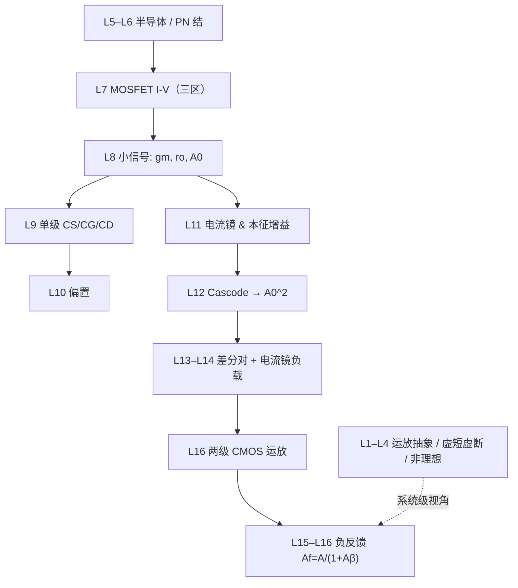

# EE115A 期末总复习 + 冲刺计划

<aside>
🎯

**考试：** EE115A 模拟电路 **期末考试** —— June 30, 2026 10:30 AM 周四 **10:30–12:30**

**地点：** 教学中心 203 教室

**题型：** 仅 **判断正误题 ＋ 计算题**（无选择 / 填空 / 简答 / 综合大题）

**Cheatsheet：** 仅可带 **一张手写 A4**（必须手写，打印会被监考老师收走）

**必带：** 计算器

**模式：** 平衡模式（知识点 + 必要解释 + 例题 + 自测）

**范围：** 全课 L1–L17，主要考**期中之后**内容；期中前为基础仍会涉及。⚠️ 期中**已考 current mirror（电流镜）**、**intrinsic gain（本征增益）未考** → 期末新增重心 = **本征增益 → Cascode → 差分对 → 反馈与运放**

**配套：** 各模块的「章节复习页」陆续生成中，本页是总纲 + 冲刺计划 + 模拟卷。

</aside>

## 一、本次考试知识地图

<aside>
🗺️

按 **重要程度** 排（非 slide 顺序）。🔴必考 / 🟠重点 / 🟡高频 / ⚪了解。期末重心在 **本征增益（L11 后半）→ Cascode → 差分对 → 反馈**；current mirror 期中已考。

</aside>

| 重要度 | 模块 | 涉及章节 | 核心问题 |
| --- | --- | --- | --- |
| 🔴 必考 | **MOSFET 小信号模型** | L7–L8 | 饱和区线性化 → $g_m$、$r_o$、本征增益 $A_0$；一切分析的「原子」。 |
| 🔴 必考 | **单级放大器 & 偏置** | L9–L10 | CS / CG / CD 三拓扑 + 阻抗变换规律 + 偏置。 |
| 🔴 必考 ⭐期中后 | **本征增益 Intrinsic Gain** | L11 | 理想电流源负载把单管推到本征增益 $A_0=g_m r_o$。**期中未考 → 期末新增重点。** |
| 🟠 重点（期中已考·基础） | **电流镜 Current Mirror** | L11 | $W/L$ 比镜像电流。**期中已考；作为偏置基础仍会涉及，但非期末新增重心。** |
| 🔴 必考 ⭐期中后 | **Cascode** | L12 | 共栅管抬高 $R_{out}$ → 增益冲到 $A_0^2$。 |
| 🔴 必考 ⭐期中后 | **差分对** | L13–L14 | 虚地 + 半电路；电流镜负载双端转单端；CMRR / ICMR。 |
| 🔴 必考 ⭐期中后 | **反馈与运放** | L15–L16 | 负反馈四大优势；$A_f=\dfrac{A}{1+A\beta}$；Series-Shunt；两级 CMOS 运放。 |
| 🟠 重点 | **MOSFET 器件与 I-V** | L7 | 截止 / 三极管 / 饱和 三区判定 + I-V 方程。 |
| 🟠 重点 | **运放抽象与应用** | L1–L4 | 黑盒模型、虚短虚断推五大运放电路、非理想效应。 |
| 🟡 高频 | **半导体 & PN 结** | L5–L6 | 载流子、PN 结 I-V、二极管方程 $I=I_S(e^{V/V_T}-1)$。 |

## 二、必考知识点排行榜

| 排名 | 知识点 | 章节 | 为什么重要 | 常见考法 |
| --- | --- | --- | --- | --- |
| 1 | 本征增益 $A_0=g_m r_o$ | L7/L8/L11 | 所有增益分析的基准量 | 计算、判断 |
| 2 | Cascode 输出阻抗与单端增益 $A_0^2$ | L12 | 提高增益的万能手段 | 计算、判断 |
| 3 | 差分对半电路 + 电流镜负载（$G_m=g_{m1,2}$） | L13–L14 | 运放输入级原型 | 计算（综合型） |
| 4 | 负反馈 $A_f=\dfrac{A}{1+A\beta}$  • 四大优势 | L15–L16 | 系统级核心思想 | 判断 + 计算 |
| 5 | 单级 CS/CG/CD 增益与阻抗变换 | L9 | 万用分析方法 | 计算 |
| 6 | 电流镜 $\dfrac{I_O}{I_{REF}}=\dfrac{(W/L)_2}{(W/L)_1}$ | L11 | 偏置与匹配基础（期中已考） | 计算 / 判断 |
| 7 | 两级 CMOS 运放 + Miller 补偿 | L16 | 运放总成结构 | 计算 |
| 8 | 小信号建模流程（确认饱和 → 画 $g_m,r_o$ → KCL/KVL） | L8 | 解题通用套路 | 全部计算题 |
| 9 | CMRR / ICMR | L14 | 差分性能指标 | 判断 / 计算 |
| 10 | MOSFET 三区判定 + I-V | L7 | 确定直流工作点 | 判断 / 计算 |

## 三、章节之间的逻辑关系

<aside>
🧭

**一句话主线：** 器件物理（半导体→MOSFET）→ 小信号原子（$g_m,r_o,A_0$）→ 单级搭积木 → 电流镜/Cascode/差分对组合出高性能 → 两级运放 + 负反馈收成系统。

</aside>

## 四、复习计划（14 天 · 6/17 → 6/30）

<aside>
⏰

距考 > 9 天 → 采用 **14 天版**。按时间顺序安排复习节奏。每日 block 默认 **20:00–22:00**（已建进日历，可自行拖动）。想压缩可只跑最后 7 天（6/24–6/30）。

</aside>

| 日期 | 任务 | 目标 |
| --- | --- | --- |
| 6/17 三 | L1–L4 运放抽象 / 虚短虚断 / 非理想 快速过 + 自测 | 重建系统级视角 |
| 6/18 四 | L5–L7 半导体 + PN 结 + MOSFET I-V 三区 | 器件物理打底 |
| 6/19 五 | L7–L8 小信号 $g_m / r_o / A_0$ 建模 | 吃透「原子」 |
| 6/20 六 | ⚠️ Project 截止当日；轻量：L9 CS/CG/CD 速记 | 三拓扑印象 |
| 6/21 日 | L9–L10 单级 + 偏置 做题 | 会算单级增益/阻抗 |
| 6/22 一 | ⭐ L11 **本征增益**（重点·期中未考）+ 电流镜（期中已考·快速过）+ 做题 | 推 $A_0$ 为主；镜像比速记 |
| 6/23 二 | ⭐ L12 Cascode（重点）：$R_{out}$ / $A_0^2$ 推导 + 做题 | 会推 cascode 增益 |
| 6/24 三 | ⭐ L13 Cascode + 差分对入门（重点） | 差分对半电路 |
| 6/25 四 | 轻量：L14 差分对 2 速读 | CMRR/ICMR 概念 |
| 6/26 五 | 轻量：L14 差分对补做题 | 差分对收尾 |
| 6/27 六 | ⭐ L15 反馈四大优势（重点）+ 做题 | $A_f$ 与去敏因子 |
| 6/28 日 | ⭐ L16 Series-Shunt + 两级 CMOS 运放（重点） | 运放总成 + 补偿 |
| 6/29 一 | 🚀 L11–L16 串讲 + 做本页模拟卷 + 考前速记版 | 查漏补缺 |
| 6/30 二 | 🎓 **期末考试** —— 考前过一遍速记 + 公式清单 | 稳定发挥 |

## 五、模拟卷（全英文 · 教材 + 开源题）

<aside>
📝

题目**全部英文**，主要来自 **Sedra/Smith《Microelectronic Circuits》课后题**（教材，考试主要据此命题）＋ **MIT OpenCourseWare 6.012** 开源题。题型对齐期末：**True/False（判断）＋ Calculation（计算）**。先做 Part A/B 的教材 & 开源原题，再用 Part C/D 自测，最后点开第六节对答案。

[书本对应题目](EE115A%20%E6%9C%9F%E6%9C%AB%E6%80%BB%E5%A4%8D%E4%B9%A0%20+%20%E5%86%B2%E5%88%BA%E8%AE%A1%E5%88%92/%E4%B9%A6%E6%9C%AC%E5%AF%B9%E5%BA%94%E9%A2%98%E7%9B%AE.md)

⚠️ 题号以 **7th edition** 为准；不同版本编号略有出入，做题时对照你书上对应小节的 Problems。HW7 已做过的 9.2 / 9.6 / 9.19 / 9.59 / 9.60 / 9.71 不再重复。

</aside>

### Part A — Sedra/Smith 教材课后题（7th ed · MOS-only 具体题号）⭐

<aside>
🚫

**更正：这部分只做 MOSFET / CMOS 题。** 凡是题干或电路图出现 **BJT / bipolar / base / emitter / collector / rπ / β / VBE** 的题，一律跳过；这些不在本次 EE115A 期末范围内。

</aside>

<aside>
🎯

**按优先级做：先做“必做 12 题”，有余力再做扩展题。** 题号以 **Sedra/Smith 7th edition** 为准；如果教材版本题号漂移，先看题干确认必须是 **MOSFET / NMOS / PMOS / CMOS**。

</aside>

| 优先级 | 模块 | 具体题号 | 练什么 |
| --- | --- | --- | --- |
| 1 | Current mirror / current source | Ch8: **8.1, 8.3, 8.5** | NMOS current mirror；saturation condition；mirror ratio；有限输出电阻。 |
| 2 | Current steering / improved mirror | Ch8: **8.4, 8.7, 8.82, 8.83** | current steering；cascode / improved MOS mirror；输出电阻提升。 |
| 3 | Cascode / folded cascode | Ch8: **8.75** | folded-cascode CMOS amplifier；headroom；输出电阻与增益估算。 |
| 4 | MOS differential pair — DC / large signal | Ch9: **9.1, 9.3, 9.5** | common-mode range；单端驱动；电流分配；差分对大信号边界。 |
| 5 | MOS differential pair — small signal | Ch9: **9.9, 9.10, 9.12** | half-circuit；differential gain；差模 / 共模小信号分析。 |
| 6 | Design / ICMR | Ch9: **9.14, 9.15, 9.16, 9.17, 9.18, 9.20** | 按指标设计 MOS differential pair；tail current；输入共模范围；输出摆幅。 |
| 7 | CMRR / tail source resistance | Ch9: **9.55, 9.56, 9.57, 9.58** | common-mode gain；CMRR；tail current source 非理想导致的共模增益。 |
| 8 | Feedback / series-shunt | Ch11: **11.1, 11.2, 11.3, D11.31** | closed-loop gain；loop gain；feedback factor；MOS feedback triple。 |

<aside>
🔥

**如果只做最小闭环：** 8.1 → 8.3 → 8.75 → 8.82 → 9.1 → 9.3 → 9.5 → 9.14 → 9.55 → 9.56 → 11.1 → D11.31。  

这 12 题覆盖：current mirror、cascode、differential pair、CMRR、feedback。

</aside>

### ⭐ 必做综合难题（从上面保留题库中优先挑 1–2 道）

<aside>
🎯

**原则：** 上面的 Part A 题目全部保留；但如果时间不够，后面这 1–2 道是必须啃下来的“综合困难题”。它们不是简单套公式，而是要求你先识别 topology(拓扑)、判断 bias / saturation、估算小信号参数，再做 gain / output resistance / design trade-off(设计权衡)。

</aside>

- ✅ 必做 1：Ch8 **8.75** — folded-cascode CMOS amplifier
    
    **为什么它是好题：**
    
    - 覆盖 **current source / current mirror bias、cascode、folded-cascode、common-gate current transfer、output resistance、intrinsic gain**。
    - 会强迫你区分 **DC bias current** 和 **small-signal output resistance**，避免把 “current source supplies 2I” 与有限 $r_o$ 混在一起。
    - 有设计味道：不是直接给你一个公式，而是让你判断哪一级限制增益、怎样通过 cascoding 提高 $R_{out}$、headroom(电压余量) 会怎么约束电路。
    
    **这题要练到什么程度：**
    
    - 能解释 $R_{in3}\approx1/g_{m3}$ 的适用口径。
    - 能说明为什么 short-circuit transconductance(短路跨导) 近似由输入管决定。
    - 能估算输出电阻来自上下两侧 cascode 支路的并联，而不是只看单个 $r_o$。
    - 能用一句话讲清 folded-cascode 的设计思想：**把输入管电流“折叠”到另一种极性的 cascode 支路，用 headroom 换高输出电阻和高增益。**
- ✅ 必做 2：Ch9 **9.14 / 9.15 / 9.16 三选一** — MOS differential pair design + ICMR
    
    **优先顺序：** 如果只做一道，先做 **9.14**；如果 9.14 已经熟，再做 **9.15 或 9.16** 作为同类强化。
    
    **为什么它是好题：**
    
    - 覆盖 **MOS differential pair 的 DC design、tail current、overdrive voltage、transconductance、input common-mode range、output swing、saturation condition**。
    - 有明确的 design constraint(设计约束)：不是“给参数算答案”，而是要在增益、摆幅、偏置电流、器件尺寸之间做 trade-off。
    - 连接后续运放输入级：会让你真正理解 differential input stage 为什么要关心 ICMR / tail source / active load。
    
    **这题要练到什么程度：**
    
    - 能从 spec(指标) 反推单管 bias current 与 $W/L$。
    - 能检查输入管、tail current source、负载管是否都在 saturation。
    - 能说清楚提高 $g_m$、降低 $V_{OV}$、增大电流或尺寸分别会带来什么代价。
    - 能把 differential pair 当作 op-amp input stage(运放输入级) 来理解，而不是只套平方律。

<aside>
🧠

**考试策略：** 8.75 负责“高增益 CMOS building block”；9.14/9.15/9.16 负责“差分输入级设计”。这两类合起来基本覆盖期中后最容易出综合计算题的主线：**current mirror → intrinsic gain → cascode → differential pair → design constraints**。

</aside>

<aside>
🔬

**综合大题精选（拒绝套公式）**

这个判断是对的：**9.55 / 9.56 基本就是把 L14 的 CMRR 公式直接代入**，属于「套公式级」。下表是真正要你「识别拓扑 → 定 DC → 算小信号 → 组合出 gain / swing / CMRR → 做设计权衡」的综合题。题号以 **7th ed** 为准，**做前先看题干确认是 MOS / CMOS（无 BJT）**；编号可能漂移，请优先按「整合知识点」对应到你书上的小节。

</aside>

| 类型 | 必做题号（每类 1 道·7th ed 待核对） | 整合的知识点 | 为什么不是套公式 |
| --- | --- | --- | --- |
| Cascode 全分析 | **必做 8.92**（有余力再加 8.94） | cascode 的 Gm、上下支路 Rout、单端增益 ~A0²、最小供电 headroom | 要把 telescopic 上、下两条 cascode 支路的 Rout 分别推出来再并联，还要逐管查 saturation 余量 |
| 高级电流镜 | **必做 8.83**（有余力再加 8.82） | cascode / Wilson mirror、Rout=gm·ro·ro、最小输出电压、镜像误差 | 要同时给出输出电阻、compliance voltage 和 systematic mismatch，三件事联动 |
| 差分对+有源负载（升级版） | **必做 9.40**（9.40~9.52 任挑 1 道同类即可） | Ad=gm(ro2‖ro4)、含有限 tail ro 的 CMRR、失配 offset | 这是 9.55 的真正升级：CMRR 要同时算 tail ro 与器件失配两条漏道，不能只代一个公式 |
| 两级 CMOS 运放整机 ⭐ | ⭐**必做 9.95**（整机大题·最优先） | 全电路 DC bias、每管 gm/ro、A1·A2、ICMR、output swing、Miller 补偿 | 期末最像综合大题：一题从 current mirror→diff pair→CS 一路走到 gain/swing，环环相扣 |
| 多级放大器 | **必做 9.88**（行有余力再做） | 级联增益、级间 Rin/Rout 阻抗衔接、双端转单端 | 要逐级算输入/输出电阻做阻抗匹配，再把各级增益串起来 |
| MOS 反馈放大器 ⭐ | ⭐**必做 11.1**（series-shunt MOS·最优先） | 识别反馈拓扑、开环 A、β、Af、含 loading 的 Rin/Rout | 必须先正确拆环、算带负载的 open-loop A，再求闭环 —— 拆错拓扑全盘皆错 |

<aside>
🧪

**综合题通用解题流程（5 步，套在上面任何一题都管用）：**

1. **识别拓扑**：CS / CG / CD / cascode / diff pair / 反馈？先认出积木。
2. **定 DC 工作点**：用 current mirror / 偏置定各管 $I_D$，确认全部在 saturation。
3. **算小信号原子**：逐管 $g_m=\dfrac{2I_D}{V_{OV}}$、$r_o=\dfrac{|V_A|}{I_D}$。
4. **组合 Gm 与 Ro**：输出短路求 $G_m$、输入置零求 $R_o$，得 $A=G_mR_o$。
5. **加约束/权衡**：ICMR、output swing、CMRR、功耗、$W/L$ —— 这一步才是「综合」与「套公式」的分水岭。
</aside>

## 五、（续）—— MOS-only 综合题精选（自拟·无 BJT）

<aside>
🧩

**用途：** 这一组是按 Sedra/Smith 课后题风格重写的 **MOS-only 综合训练题**，用于绕开 7th ed 2015 题号漂移问题。  

**边界：** 不是原书逐字题干；题型、参数、考点对齐本次 EE115A 期末范围。看到原书题里出现 **BJT / bipolar / base / emitter / collector /** $r_\pi$ **/** $\beta$ **/** $V_{BE}$，直接跳过。  

**目标：** 不再刷 9.55 这种只带公式的 warm-up；重点练「bias → $g_m,r_o$ → $G_m$ → $R_o$ → gain → headroom / feedback」完整链条。

</aside>

### 自拟题 ↔ 原书题一一对应表

<aside>
🧭

**读法：** 左边是前文列出的「MOS-only 自拟综合题」，右边是教材 7ed 2015 里最对应的原书题。没有完全一模一样原题的，我标成「拼合题」并给最接近的原题组合。

</aside>

| 自拟题 | 最对应原书题 | 对应程度 | 怎么用 |
| --- | --- | --- | --- |
| 题 1 — Advanced MOS Current Mirror / Cascode Current Source | **8.82 + 8.83** | 高度对应 | 8.82 练 cascoded current mirror 的电流、gate voltage、输出电阻；8.83 练 double-cascode current mirror 输出电阻。 |
| 题 2 — Folded-Cascode CMOS Amplifier | **8.75** | 最精确对应 | 直接做 8.75。它就是 folded-cascode CMOS amplifier，带 Fig. P8.75，内容覆盖 resistance、输出电阻、短路跨导、增益。 |
| 题 3 — MOS Differential Pair Design with Power and Headroom | **9.14**（同类：9.15 / 9.16） | 最精确对应 | 9.14 就是 power、gain、output common-mode voltage、W/L 的设计题；9.15 练 current steering；9.16 是较轻量同类题。 |
| 题 4 — MOS Differential Pair with Current-Mirror Active Load | **9.92**（同类：9.85 / 9.88） | 高度对应 | 9.92 最像：给 NMOS/PMOS overdrive、Early voltage，求 Gm、Ro、Ad；9.85 是测量版，9.88 是反推 bias current 版。 |
| 题 5 — Two-Stage CMOS Op Amp | **9.114**（同类：9.118） | 最精确对应 | 9.114 是 two-stage CMOS op amp 原书整机设计题；9.118 是同图 P9.114 的另一版工艺参数题。 |
| 题 6 — MOS Series-Shunt Feedback Amplifier | **11.31**（进阶：11.41 / 11.43 / 11.51） | 高度对应 | 11.31 就是 MOS feedback triple；先做它。11.41 更器件级，11.43 是 CMOS op amp + feedback 拔高题。 |
| 题 7 — Cascode Differential Pair + Current-Mirror Load | **9.98 + 9.101**；严格 MOS-only 可用 **9.92 + 9.105** 替代 | 拼合对应 | 原书没有完全同一句题干。9.98 对应 differential cascode + active load；9.101 对应 folded-cascode differential amplifier 和 swing/headroom；若担心 Wilson / bipolar 牵涉，改做 9.92 + 9.105。 |

<aside>
🔥

**最小替换清单：** 如果你不做自拟题，只做原书对应题，就做 **8.75 → 8.82/8.83 → 9.14 → 9.92 → 9.114 → 11.31**。  

题 7 那个高增益差分压轴题没有完全一对一原题；用 **9.98 / 9.101** 对应拓扑，用 **9.92 / 9.105** 保证 MOS-only 计算链。

</aside>

### ✅ 最小闭环做题顺序

1. **题 3**：MOS differential pair design —— 稳住 $I/2$、power、$R_D$、$W/L$。
2. **题 4**：current-mirror active load —— 搞清 differential-to-single-ended conversion。
3. **题 2**：folded / cascode —— 练 $G_m$、$R_o$、$A_0^2$ 主线。
4. **题 6**：feedback —— 保底 series-shunt、loop gain、去敏。
5. **题 7**：压轴综合 —— cascode differential pair + current-mirror load。
6. **题 1 / 题 5**：有时间再补 advanced current mirror / two-stage op amp。
- 题 1 — Advanced MOS Current Mirror / Cascode Current Source
    
    A basic NMOS current mirror is biased by a reference current $I_{REF}=50\,\mu\text{A}$. Transistor $M_1$ is diode-connected, and transistor $M_2$ provides the output current. Both transistors have the same channel length. Assume:
    
    - $(W/L)_1=10$
    - $(W/L)_2=40$
    - $V_{tn}=0.4\,\text{V}$
    - $V_{OV1}=V_{OV2}=0.2\,\text{V}$ at the intended operating point
    - $V_A'=10\,\text{V}/\mu\text{m}$
    - $L=0.5\,\mu\text{m}$
    - Ignore body effect.
    
    **(a)** Find the ideal output current $I_O$ ignoring channel-length modulation.
    
    **(b)** Find $r_{o2}$ and estimate the output resistance of the simple current mirror.
    
    **(c)** Find the minimum output voltage $V_{O,\min}$ required to keep $M_2$ in saturation.
    
    Now replace $M_2$ by a cascode current-source branch consisting of $M_2$ and $M_3$, where $M_3$ is the cascode device. Assume $M_2$ and $M_3$ carry the same current and have identical $g_m$ and $r_o$.
    
    **(d)** Estimate the output resistance of the cascode current source.
    
    **(e)** Compare the simple mirror and cascode mirror in terms of output resistance and voltage headroom.
    
    <aside>
    🎯
    
    **考点：** current mirror ratio、$r_o$、cascode output resistance、saturation headroom。  
    
    **综合点：** 不只算镜像比，还要同时判断 current accuracy、output resistance、compliance voltage。
    
    </aside>
    
- 题 2 — Folded-Cascode CMOS Amplifier
    
    Consider a folded-cascode CMOS amplifier. An NMOS input transistor $M_1$ converts the input voltage $v_i$ into a small-signal drain current. This current is folded through a PMOS common-gate transistor $M_3$ into the output node. The output node is loaded by a cascoded current-source load.
    
    Assume all MOSFETs operate in saturation and have:
    
    - $g_m=1\,\text{mA/V}$
    - $r_o=100\,\text{k}\Omega$
    - $g_m r_o\gg1$
    - Body effect is ignored.
    - The input transistor $M_1$ has transconductance $g_{m1}=1\,\text{mA/V}$.
    - The folded common-gate transistor $M_3$ has $g_{m3}=1\,\text{mA/V}$.
    - The top cascoded current-source load has output resistance approximately $R_{op}=g_m r_o^2$.
    - The lower folded-cascode branch has output resistance approximately $R_{on}=g_m r_o^2$.
    
    **(a)** Estimate the small-signal input resistance looking into the source of the common-gate transistor $M_3$.
    
    **(b)** Explain why most of the signal current generated by $M_1$ flows into $M_3$ rather than into the output resistance of $M_1$.
    
    **(c)** Estimate the short-circuit transconductance $G_m=i_{sc}/v_i$ of the whole amplifier.
    
    **(d)** Estimate the total output resistance $R_o$ at the output node.
    
    **(e)** Estimate the open-circuit voltage gain $A_v=G_mR_o$.
    
    **(f)** If only the lower branch is cascoded but the load branch is a simple current-source load with resistance $r_o$, estimate the new voltage gain. Explain why the gain no longer reaches the $A_0^2$ level.
    
    <aside>
    🎯
    
    **考点：** folded cascode、common-gate input resistance、short-circuit transconductance、output resistance、$A_0^2$ 增益。  
    
    **综合点：** 要识别哪一侧 output resistance 限制增益；只 cascode 一边会被另一边 $r_o$ 拉回 $A_0$ 量级。
    
    </aside>
    
- 题 3 — MOS Differential Pair Design with Power and Headroom Constraints
    
    Design an NMOS differential pair with resistive loads. The circuit uses dual power supplies:
    
    $$
    V_{DD}=+1\,\text{V},\qquad V_{SS}=-1\,\text{V}
    $$
    
    Each drain is connected to $V_{DD}$ through a resistor $R_D$. The pair is biased by an ideal tail current source $I$. At equilibrium, the two input voltages are equal and the drain dc voltage of each side must be:
    
    $$
    V_D=0.2\,\text{V}
    $$
    
    The required differential gain is:
    
    $$
    |A_d|=10\,\text{V/V}
    $$
    
    The total dc power dissipation must not exceed:
    
    $$
    P_D=1\,\text{mW}
    $$
    
    The process parameter is:
    
    $$
    \mu_n C_{ox}=400\,\mu\text{A/V}^2
    $$
    
    Ignore channel-length modulation and body effect.
    
    **(a)** Find the maximum allowable tail current $I$ from the power constraint.
    
    **(b)** Using the equilibrium drain voltage, find $R_D$.
    
    **(c)** Find the required $g_m$ of each input transistor.
    
    **(d)** Find $V_{OV}$ for each input transistor.
    
    **(e)** Find $W/L$ for each input transistor.
    
    **(f)** State the saturation condition for the input transistors using $V_{DS}\ge V_{OV}$. What constraint does this impose on the common-source node voltage $V_S$?
    
    <aside>
    🎯
    
    **考点：** differential pair design、power dissipation、$I/2$、$g_m$、$V_{OV}$、$W/L$、headroom。  
    
    **综合点：** 条件分散在 power、gain、DC output voltage、saturation 里；缺方程时先扫 spec。
    
    </aside>
    
- 题 4 — MOS Differential Pair with Current-Mirror Active Load
    
    A CMOS differential amplifier consists of an NMOS differential pair $M_1,M_2$ biased by an ideal tail current source $I_{SS}$. The drains of $M_1,M_2$ are connected to a PMOS current-mirror active load $M_3,M_4$, producing a single-ended output at the drain of $M_2$ and $M_4$.
    
    Assume the balanced bias point gives:
    
    - $I_{SS}=200\,\mu\text{A}$
    - Each input NMOS carries $100\,\mu\text{A}$
    - $g_{mn}=1\,\text{mA/V}$ for $M_1,M_2$
    - $r_{on}=100\,\text{k}\Omega$ for each NMOS input transistor
    - $r_{op}=100\,\text{k}\Omega$ for each PMOS load transistor
    - Body effect is ignored.
    - The PMOS current mirror is ideal in current transfer but has finite output resistance.
    
    **(a)** Under pure differential excitation, explain why the common-source node of the NMOS pair is an ac virtual ground.
    
    **(b)** For a small differential input $v_{id}$, determine the incremental drain currents in $M_1$ and $M_2$.
    
    **(c)** Explain how the PMOS current mirror converts the differential signal into a single-ended output current.
    
    **(d)** Show that the effective transconductance from $v_{id}$ to the single-ended output current is approximately $G_m\approx g_{mn}$.
    
    **(e)** Estimate the output resistance at the output node.
    
    **(f)** Estimate the single-ended differential voltage gain $A_d$.
    
    **(g)** If the tail current source has finite output resistance $R_{SS}=500\,\text{k}\Omega$, qualitatively explain how common-mode gain and CMRR are affected.
    
    <aside>
    🎯
    
    **考点：** current-mirror active load、differential-to-single-ended conversion、$G_m=g_m$、$R_o=r_{on}\parallel r_{op}$、CMRR。  
    
    **综合点：** 关键不是代 $A_d=g_mR_o$，而是解释电流镜怎样把双端信号合成单端输出。
    
    </aside>
    
- 题 5 — Two-Stage CMOS Op Amp
    
    A two-stage CMOS op amp consists of:
    
    1. First stage: NMOS differential pair with PMOS current-mirror active load.
    2. Second stage: NMOS common-source amplifier with PMOS current-source load.
    3. A Miller compensation capacitor $C_C$ is connected between the output of the second stage and the output of the first stage.
    
    Assume:
    
    **First stage**
    
    - Effective transconductance: $G_{m1}=1\,\text{mA/V}$
    - NMOS output resistance: $r_{on1}=100\,\text{k}\Omega$
    - PMOS load output resistance: $r_{op1}=100\,\text{k}\Omega$
    
    **Second stage**
    
    - Transconductance: $g_{m2}=2\,\text{mA/V}$
    - NMOS output resistance: $r_{on2}=50\,\text{k}\Omega$
    - PMOS load output resistance: $r_{op2}=50\,\text{k}\Omega$
    
    **Other data**
    
    - Load capacitance: $C_L=2\,\text{pF}$
    - Miller compensation capacitor: $C_C=1\,\text{pF}$
    - Ignore body effect.
    
    **(a)** Estimate the output resistance of the first stage.
    
    **(b)** Estimate the voltage gain of the first stage $A_1$.
    
    **(c)** Estimate the output resistance of the second stage.
    
    **(d)** Estimate the voltage gain of the second stage $A_2$.
    
    **(e)** Estimate the overall open-loop gain $A_o=A_1A_2$ in V/V and dB.
    
    **(f)** Explain why Miller compensation creates a dominant pole at the first-stage output node.
    
    **(g)** Estimate the unity-gain frequency using:
    
    $$
    \omega_t\approx \frac{G_{m1}}{C_C}
    $$
    
    **(h)** Explain the trade-off between increasing $C_C$ and amplifier bandwidth / stability.
    
    <aside>
    🎯
    
    **考点：** 两级 CMOS op amp、diff pair active load、CS second stage、open-loop gain、Miller compensation。  
    
    **综合点：** 先拆两级，再合成系统级 $A_o$ 和频率补偿。
    
    </aside>
    
- 题 6 — MOS Series-Shunt Feedback Amplifier
    
    A MOS amplifier has an open-loop voltage gain $A$ and uses resistive voltage feedback in a series-shunt configuration. The feedback network consists of $R_1$ from the input mixing node to ground and $R_2$ from the output node to the input mixing node. The ideal feedback factor is:
    
    $$
    \beta=\frac{R_1}{R_1+R_2}
    $$
    
    The forward amplifier without feedback has:
    
    - Open-loop gain: $A=2000\,\text{V/V}$
    - Input resistance: $R_i=20\,\text{k}\Omega$
    - Output resistance: $R_o=50\,\text{k}\Omega$
    
    The desired ideal closed-loop gain is approximately:
    
    $$
    A_f\approx 10\,\text{V/V}
    $$
    
    **(a)** Choose the ratio $R_2/R_1$ to obtain the desired ideal closed-loop gain.
    
    **(b)** Find $\beta$.
    
    **(c)** Find the loop gain $A\beta$.
    
    **(d)** Find the exact closed-loop gain:
    
    $$
    A_f=\frac{A}{1+A\beta}
    $$
    
    **(e)** Find the amount of feedback $1+A\beta$.
    
    **(f)** Estimate the closed-loop input resistance for series mixing:
    
    $$
    R_{if}=R_i(1+A\beta)
    $$
    
    **(g)** Estimate the closed-loop output resistance for shunt sampling:
    
    $$
    R_{of}=\frac{R_o}{1+A\beta}
    $$
    
    **(h)** If the open-loop gain $A$ decreases by 20%, estimate the percentage change in $A_f$. Use gain desensitivity.
    
    <aside>
    🎯
    
    **考点：** series-shunt feedback、loop gain、closed-loop gain、input/output resistance transformation、gain desensitivity。  
    
    **综合点：** 先判断 series/shunt 对 $R_i$、$R_o$ 的方向影响，再代反馈公式。
    
    </aside>
    
- 题 7 — 综合压轴：Cascode Differential Pair + Current-Mirror Load
    
    A high-gain CMOS differential amplifier uses an NMOS differential input pair with a cascoded PMOS current-mirror load. The single-ended output is taken at the drain of one input transistor and its PMOS load branch.
    
    Assume all MOSFETs operate in saturation. At the bias point:
    
    - Tail current: $I_{SS}=200\,\mu\text{A}$
    - Each side carries $100\,\mu\text{A}$
    - For all signal-path transistors: $g_m=1\,\text{mA/V}$
    - For all transistors: $r_o=100\,\text{k}\Omega$
    - Body effect is ignored.
    - The cascode devices are biased properly.
    
    **(a)** Find the intrinsic gain $A_0=g_mr_o$ of one transistor.
    
    **(b)** Estimate the output resistance of one cascoded branch.
    
    **(c)** Estimate the total output resistance at the single-ended output node, assuming the NMOS side and PMOS side are both cascoded.
    
    **(d)** Determine the effective transconductance $G_m$ of the current-mirror-loaded differential pair.
    
    **(e)** Estimate the voltage gain $A_d=G_mR_o$.
    
    **(f)** Compare this gain with a non-cascoded current-mirror-loaded differential pair whose output resistance is only $r_{on}\parallel r_{op}$.
    
    **(g)** Explain the cost of cascoding in terms of output swing and supply voltage headroom.
    
    <aside>
    🎯
    
    **考点：** differential pair + current mirror + cascode + $A_0^2$ 增益 + headroom。  
    
    **综合点：** 这是最接近期末综合计算题的结构：先定 $G_m$，再定两侧 cascoded $R_o$，最后看 gain 和 headroom trade-off。
    
    </aside>
    
- 🧹 已排除 / 不再推荐
    - 不再推荐旧表里的 **8.11, 8.13, 8.15**：题号定位不稳，且容易混到非本课重点。
    - **9.2 / 9.6 / 9.19 / 9.59 / 9.60 / 9.71**：HW7 已做过，不重复安排。
    - Ch9 中所有明确写 **BJT differential pair / bipolar differential pair** 的题全部跳过。
    - Ch11 里如果遇到 BJT 实现的反馈放大器，只保留抽象 feedback 计算；器件级 BJT 小信号不做。

<aside>
🔎

对答案：教材原题可对照官方解答手册 **"KC's Problems and Solutions for Microelectronic Circuits"** 或书末 Answers；但只核对 MOSFET / CMOS 题，看到 BJT 解答直接跳过。

</aside>

### Part B — 开源题（MIT OpenCourseWare 6.012, 全英文, 可直接做）⭐

<aside>
🌐

来源：MIT OCW 6.012 *Microelectronic Devices and Circuits*, Problem Set 10（开源）。已改写为通用 MOSFET 语言。

</aside>

**B1（Cascode = CS + CG 两级）.** Consider a two-stage amplifier: a common-source (CS) first stage followed by a common-gate (CG) second stage. Use two-port models; the CG substrate is tied to its source (drop $g_{mb}$), and assume the stage load conductance is negligible (so $R_{in}=1/g_m$ and the CG current gain is unity).

(a) Calculate the overall voltage gain $v_{out}/v_{in}$ and compare it with the single CS stage.

(b) Calculate the output resistance $R_o$ and compare it with the single CS stage.

**B2（电流镜有源负载差分对）.** A MOS differential pair $Q_1,Q_2$ is first loaded by two equal drain resistors $R_2=R_3$.

(a) Write the differential-mode gain in terms of the MOSFET K-factor and the bias current; choose $R_2(=R_3)$ and $I_D$ to maximize $|A_{vd}|$.

(b) Now replace $R_2,R_3$ with a p-channel current-mirror active load ($|V_T|=1\,\text{V},\ |V_A|=20\,\text{V}$). Sketch the mirror and calculate the impact on the voltage gain.

### Part C — True / False（判断, 全英文, 期末同题型）⭐

1. In a cascode amplifier, the common-gate transistor raises the output resistance by roughly $A_0=g_m r_o$, pushing the single-ended gain toward $A_0^2$. ( F )
2. To realize the full $A_0^2$ gain, only the bottom device must be cascoded; the load can stay a simple $r_o$. ( F )
3. The current-mirror ratio is set by the ratio of the two transistors' $W/L$ (equal $V_{GS}$, ignoring channel-length modulation). ( T )
4. Negative feedback widens the bandwidth while increasing the closed-loop gain proportionally. (T)
5. Under pure differential drive, the common-source node of a differential pair behaves as an AC virtual ground. ( T )
6. A current-mirror active load on a MOS differential pair both performs differential-to-single-ended conversion and gives $G_m=g_{m1,2}$. ( T )

### Part C2 — 基础概念判断题（更基础 · 覆盖全程）⭐

<aside>
🧩

全英文判断题，偏**概念 / 定义 / 定性**，比 Part C 更基础，用来打地基。先自己在括号里写 T/F，再点开最后的答案核对。

</aside>

**MOSFET 器件与 I-V**

1. In saturation, an NMOS behaves approximately as a voltage-controlled current source. (  )
2. Near $V_{DS}\approx0$ in the triode region, a MOSFET behaves like a voltage-controlled resistor. (  )
3. An NMOS is in saturation when $V_{GS}>V_t$ and $V_{DS}\ge V_{OV}$. (  )
4. In saturation, increasing $V_{DS}$ strongly increases $I_D$; channel-length modulation is the dominant effect on the current. (  )

**小信号原子** $g_m / r_o / A_0$

1. The transconductance can be written $g_m=2I_D/V_{OV}$. (  )
2. The output resistance follows $r_o=V_A/I_D$, so it is inversely proportional to the bias current. (  )
3. The intrinsic gain $A_0=g_m r_o$ keeps increasing without bound as the bias current increases. (  )

**单级放大器 CS / CG / CD**

1. A common-source stage provides high voltage gain with an inverting (180°) output. (  )
2. A common-drain (source follower) has a voltage gain close to unity and a low output resistance. (  )
3. Looking into the source of a common-gate stage, the input resistance is high. (  )

**电流镜 & 本征增益**

1. An ideal current-source load lets a single CS transistor reach its intrinsic gain $A_0=g_m r_o$. (  )
2. In a simple MOS current mirror with equal $V_{GS}$, the output current is set by the ratio of $W/L$. (  )

**Cascode**

1. The main purpose of cascoding is to raise the output resistance, and hence the voltage gain. (  )
2. Cascoding improves gain but reduces the available output voltage swing (headroom). (  )

**差分对 & CMRR**

1. For a common-mode input, the two drain currents of a differential pair change in opposite directions. (  )
2. The differential half-circuit lets you analyze a differential pair as a single CS stage. (  )
3. A larger output resistance of the tail current source ($R_{SS}$) improves the CMRR. (  )

**反馈与运放**

1. Negative feedback desensitizes the closed-loop gain to variations in the open-loop gain. (  )
2. Series (voltage) mixing at the input raises the input resistance by the factor $(1+A\beta)$. (  )
3. An ideal op amp has infinite open-loop gain, infinite input resistance, and zero output resistance. (  )
- 📑 点开对照答案 + 解析（Part C2）
    1. **True.** 饱和区 MOS 近似为压控电流源（VCCS）：$I_D$ 由 $V_{GS}$ 控制、几乎与 $V_{DS}$ 无关。
    2. **True.** 三极管区在 $V_{DS}\to0$ 附近近似为压控电阻。
    3. **True.** 饱和条件：$V_{GS}>V_t$ 且 $V_{DS}\ge V_{OV}=V_{GS}-V_t$。
    4. **False.** 饱和区 $V_{DS}$ 升高只通过 channel-length modulation 让 $I_D$ **略**升（斜率 $1/r_o$），不是主导；一阶近似 $I_D$ 与 $V_{DS}$ 无关。
    5. **True.** $g_m=\dfrac{2I_D}{V_{OV}}=k V_{OV}=\sqrt{2kI_D}$ 三种写法等价。
    6. **True.** $r_o=\dfrac{V_A}{I_D}$，与 $I_D$ 成反比。
    7. **False.** 固定器件下 $g_m\propto\sqrt{I_D}$、$r_o\propto1/I_D$，所以 $A_0=g_m r_o\propto1/\sqrt{I_D}$ —— 电流越大本征增益反而**越小**。
    8. **True.** CS = 高增益 + 反相输出。
    9. **True.** 源跟随器增益 $\approx1$、输出电阻低（$\approx1/g_m$）。
    10. **False.** 从 source 看进去 CG 的输入电阻**低**，$\approx1/g_m$；高输入电阻是从 gate 看（MOS 栅极）。
    11. **True.** 理想电流源负载把 CS 推到本征增益 $A_0=g_m r_o$。
    12. **True.** 简单镜：$\dfrac{I_O}{I_{REF}}=\dfrac{(W/L)_2}{(W/L)_1}$。
    13. **True.** cascode 的核心目的就是抬高 $R_{out}$ → 提高增益。
    14. **True.** 代价是多堆一管、output swing / headroom 变小。
    15. **False.** 共模输入时两边漏电流**同向**变化（一起增大或减小）；反向变化是差模。
    16. **True.** 差模半电路把差分对化简成单边 CS 来分析。
    17. **True.** $R_{SS}$ 越大 → 共模增益 $A_{cm}\approx-\dfrac{R_D}{2R_{SS}}$ 越小 → CMRR 越高。
    18. **True.** 负反馈去敏：闭环增益对开环增益变化不敏感，灵敏度 ÷$(1+A\beta)$。
    19. **True.** series（电压）混合提高输入电阻：$R_{if}=R_i(1+A\beta)$。
    20. **True.** 理想运放：开环增益 $\infty$、输入电阻 $\infty$、输出电阻 $0$。
    
    <aside>
    🐈
    
    **🐈 判断题防坑提醒：**
    
    - 看到「increase / decrease / 同向 / 反向 / 高 / 低」这类**方向词**要格外小心，正误常卡在这里（比如第 4、7、10、15 题）。
    - 「负反馈展宽带宽」对，但「同时增大增益」错 —— 增益是被**降低**的。
    - 「电流越大增益越高」对 $g_m$ 成立，但对**本征增益** $A_0$ **反而越低**。
    </aside>
    

### Part D — Calculation（计算, 全英文, 仿教材风格）⭐

1. An NMOS in saturation has $I_D=0.2\,\text{mA}$, $V_{OV}=0.2\,\text{V}$, $V_A=10\,\text{V}$. Find $g_m$, $r_o$, and the intrinsic gain $A_0$.
2. The device in D1 is used as an ideal-current-source-loaded CS stage, then a cascode (CG) device is added on top. Estimate the single-ended voltage gain $A_v$.
3. A current mirror has $(W/L)_1=10$, $(W/L)_2=40$, $I_{REF}=50\,\mu\text{A}$. Find the output current $I_O$ (ignore channel-length modulation).
4. A two-stage op-amp has $A_1=100$ (diff stage) and $A_2=100$ (CS stage). Find $A_o$. With series-shunt feedback $\beta=0.1$, find $A_f$ and the amount of feedback $(1+A\beta)$.
5. A MOS differential pair with current-mirror load has $g_{m1,2}=1\,\text{mA/V}$ and $R_o=r_{o2}\|r_{o4}=100\,\text{k}\Omega$. Find $A_d=G_m R_o$.

## 六、答案与解析

- 📑 点开对照答案 + 解析（Part C / D）
    
    ### Part C — True / False
    
    1. **True.** cascode 把 $R_{out}$ 抬到 $\sim A_0 r_o$，单端增益 $\to A_0^2$。
    2. **False.** 必须**上下负载都 cascode**；只 cascode 一侧，另一侧的 $r_o$ 会把增益拉回 $\sim A_0$。
    3. **True.** $\dfrac{I_O}{I_{REF}}=\dfrac{(W/L)_2}{(W/L)_1}$。
    4. **False.** 增益带宽积近似守恒：带宽 ×$(1+A\beta)$、增益 ÷$(1+A\beta)$ —— 增益是被**降低**的。
    5. **True.** 差模反对称 → 公共源点电位不动 = 交流虚地。
    6. **True.** 电流镜负载完成双端转单端，且让 $G_m=g_{m1,2}$（满 $g_m$）。
    
    ### Part D — Calculation
    
    1. $g_m=\dfrac{2I_D}{V_{OV}}=\dfrac{2\times0.2\text{m}}{0.2}=2\,\text{mA/V}$；$r_o=\dfrac{V_A}{I_D}=\dfrac{10}{0.2\text{m}}=50\,\text{k}\Omega$；$A_0=g_m r_o=100$（≈40 dB）。
    2. $A_v\approx -A_0^2=-100^2=-10^4$（≈80 dB）。
    3. $I_O=I_{REF}\dfrac{(W/L)_2}{(W/L)_1}=50\,\mu\text{A}\times\dfrac{40}{10}=200\,\mu\text{A}$。
    4. $A_o=A_1A_2=10^4$；$1+A_o\beta=1+10^4\times0.1=1001$；$A_f=\dfrac{A_o}{1+A_o\beta}=\dfrac{10^4}{1001}\approx 9.99\approx 1/\beta=10$。
    5. $A_d=G_m R_o=1\,\text{mA/V}\times100\,\text{k}\Omega=100$（≈40 dB）。
    
    ### Part A / B 对答案
    
    - **Part A（教材题）**：对照 **"KC's Problems and Solutions"** 或书末答案。
    - **B1**：两级 CS+CG 即 cascode → $A_v\approx -g_m R_{out}\approx -(g_m r_o)^2=-A_0^2$；$R_o\approx g_m r_o\cdot r_o=A_0 r_o$（≫ 单 CS 的 $r_o$）。
    - **B2**：(a) $|A_{vd}|=g_m R_D$（受 $R_D$ 限制）；(b) 换电流镜有源负载后 $R_{out}=r_{on}\|r_{op}$，$A_{vd}=g_m(r_{on}\|r_{op})$ → 增益升到本征增益量级，且完成双端转单端。

<aside>
🔗

**配套课堂笔记直达：** [EE115 Lecture11 — IC Building Blocks: Current Mirror & Intrinsic Gain](EE115%20Lecture11%20%E2%80%94%20IC%20Building%20Blocks%20Current%20Mirro.md) · [EE115 Lecture12 — Cascode Amplifier](EE115%20Lecture12%20%E2%80%94%20Cascode%20Amplifier.md) · [EE115 Lecture13 — Cascode & Differential Amplifiers](EE115%20Lecture13%20%E2%80%94%20Cascode%20&%20Differential%20Amplifier.md) · [EE115 Lecture14 — Differential Amplifiers 2](EE115%20Lecture14%20%E2%80%94%20Differential%20Amplifiers%202.md) · [EE115 Lecture15 — Feedback 基础与负反馈四大优势](EE115%20Lecture15%20%E2%80%94%20Feedback%20%E5%9F%BA%E7%A1%80%E4%B8%8E%E8%B4%9F%E5%8F%8D%E9%A6%88%E5%9B%9B%E5%A4%A7%E4%BC%98%E5%8A%BF.md) · [EE115 Lecture16 — Feedback 基础与 Series-Shunt 拓扑](EE115%20Lecture16%20%E2%80%94%20Feedback%20%E5%9F%BA%E7%A1%80%E4%B8%8E%20Series-Shunt%20%E6%8B%93%E6%89%91.md) · [EE115 Lecture17 — 期末复习：MOSFET → 单级 → 差分 → 运放 → 反馈](EE115%20Lecture17%20%E2%80%94%20%E6%9C%9F%E6%9C%AB%E5%A4%8D%E4%B9%A0%EF%BC%9AMOSFET%20%E2%86%92%20%E5%8D%95%E7%BA%A7%20%E2%86%92%20%E5%B7%AE%E5%88%86%20%E2%86%92%20%E8%BF%90%E6%94%BE%20%E2%86%92%20%E5%8F%8D%E9%A6%88.md)

</aside>

[EE115A 期末复习 — Cascode 放大器（L12）](EE115A%20%E6%9C%9F%E6%9C%AB%E6%80%BB%E5%A4%8D%E4%B9%A0%20+%20%E5%86%B2%E5%88%BA%E8%AE%A1%E5%88%92/EE115A%20%E6%9C%9F%E6%9C%AB%E5%A4%8D%E4%B9%A0%20%E2%80%94%20Cascode%20%E6%94%BE%E5%A4%A7%E5%99%A8%EF%BC%88L12%EF%BC%89.md)

[EE115A 期末复习 — 电流镜 & 本征增益（L11）](EE115A%20%E6%9C%9F%E6%9C%AB%E6%80%BB%E5%A4%8D%E4%B9%A0%20+%20%E5%86%B2%E5%88%BA%E8%AE%A1%E5%88%92/EE115A%20%E6%9C%9F%E6%9C%AB%E5%A4%8D%E4%B9%A0%20%E2%80%94%20%E7%94%B5%E6%B5%81%E9%95%9C%20&%20%E6%9C%AC%E5%BE%81%E5%A2%9E%E7%9B%8A%EF%BC%88L11%EF%BC%89.md)

[EE115A 期末复习 — 反馈与运放（L15–L16）](EE115A%20%E6%9C%9F%E6%9C%AB%E6%80%BB%E5%A4%8D%E4%B9%A0%20+%20%E5%86%B2%E5%88%BA%E8%AE%A1%E5%88%92/EE115A%20%E6%9C%9F%E6%9C%AB%E5%A4%8D%E4%B9%A0%20%E2%80%94%20%E5%8F%8D%E9%A6%88%E4%B8%8E%E8%BF%90%E6%94%BE%EF%BC%88L15%E2%80%93L16%EF%BC%89.md)

[EE115A 期末复习 — 差分对（L13–L14）](EE115A%20%E6%9C%9F%E6%9C%AB%E6%80%BB%E5%A4%8D%E4%B9%A0%20+%20%E5%86%B2%E5%88%BA%E8%AE%A1%E5%88%92/EE115A%20%E6%9C%9F%E6%9C%AB%E5%A4%8D%E4%B9%A0%20%E2%80%94%20%E5%B7%AE%E5%88%86%E5%AF%B9%EF%BC%88L13%E2%80%93L14%EF%BC%89.md)

[EE115A 期末 Cheatsheet ✍️ 两面 A4 · 誊抄版](EE115A%20%E6%9C%9F%E6%9C%AB%E6%80%BB%E5%A4%8D%E4%B9%A0%20+%20%E5%86%B2%E5%88%BA%E8%AE%A1%E5%88%92/EE115A%20%E6%9C%9F%E6%9C%AB%20Cheatsheet%20%E2%9C%8D%EF%B8%8F%20%E4%B8%A4%E9%9D%A2%20A4%20%C2%B7%20%E8%AA%8A%E6%8A%84%E7%89%88.md)

## 五、（续）—— part A 具体题目

- 8.75

- Q：8.75 里的 current source “supplies 2I” 和有限内阻 $r_o$ 怎么理解？
    
    **结论：题目说 supply** $2I$**，就是把这个 current source 的 DC bias current 定义为** $2I$**。** 不要再因为它有有限输出电阻 $r_o$，把电流算成“比 $2I$ 更小”。
    
    - **DC 大信号层面：** $2I$ 是题目给定的静态供电电流 / 偏置电流。后面算各支路电流时，就按这个 current source 提供总电流 $2I$ 来分配。
    - **小信号层面：** 非理想 current source 等效成“理想电流源 + 输出电阻 $r_o$”时，$r_o$ 表示电流会随端口电压变化的斜率。也就是有信号扰动时：
    
    $$
    \Delta i \approx \frac{\Delta v}{r_o}
    $$
    
    这里的 $\Delta i$ 是围绕 bias point 的增量电流，不是从 DC 的 $2I$ 里再分走一部分。
    
    - **所以不要理解成：** “理想源给 $2I$，然后 $r_o$ 分流，最后实际供给小于 $2I$。”
    - **应该理解成：** “这个电流源的静态端口电流就是 $2I$；有限 $r_o$ 只说明它不是 perfect current source，端口电压变化时电流会偏离 $2I$。”
    
    考试做题口径：用 $2I$ 定 DC 工作点；用 $r_o$ 算小信号输出电阻 / 增益下降。
    
- Q：8.75(c) 为什么 $G_m\approx g_{m1}$？以及 a 问的 $R_{in3}$ 为什么不直接取决于 $R_{o4}$？
    
    **先纠正一个容易混掉的点：这个判断是对的，图里标的** $R_{in3}$ **是 a 问的“indicated resistance”，不是 c 问才定义出来的量。**  
    
    前文曾把“c 问输出短路”直接拿来解释 a 问的 $R_{in3}$，这会让逻辑混乱。更准确的说法是：
    
    - **a 问的** $R_{in3}$**：** 教材在做分块估算，把 Q3 看成 common-gate 管，列它 source 端的局部输入电阻，考试口径取 $R_{in3}\approx1/g_{m3}$。
    - **c 问的 short-circuit：** 是为了求整个放大器的 $G_m=i_{sc}/v_i$。在 c 问里 $v_o$ 被短路，这会让 Q3 drain 成为 AC ground，因此更支持使用 $R_{in3}\approx1/g_m$ 的近似。
    
    ## 1. a 问的 $R_{in3}$ 是什么？
    
    $R_{in3}$ 指的是：**从 Q3 的 source 端看进去，Q3 common-gate 级对前一级呈现多大的输入电阻。**
    
    Q3 的 gate 是偏置电压，所以小信号 gate 是 AC ground。若把 Q3 drain 作为 AC ground 或近似固定电位来做 common-gate 局部估算，则：
    
    $$
    v_{gs3}=v_g-v_s=0-v_s=-v_s
    $$
    
    从 source 端加测试电压 $v_s$，source 端电流约为：
    
    $$
    i_s=g_mv_s+\frac{v_s}{r_o}
    $$
    
    所以：
    
    $$
    																					R_{in3}=\frac{v_s}{i_s}
    =\frac{1}{g_m+\frac{1}{r_o}}
    $$
    
    因为：
    
    $$
    g_mr_o=A_0\gg1
    $$
    
    所以：
    
    $$
    R_{in3}\approx \frac{1}{g_m}
    $$
    
    这就是 a 问里常写的答案：
    
    $$
    \boxed{R_{in3}\approx \frac{1}{g_{m3}}}
    $$
    
    ## 2. 那为什么不把 $R_L=R_{o4}$ 放进去？
    
    该疑惑是非常合理的：如果严格从 Q3 source 往整个后级看，Q3 drain 确实连着输出节点，而输出节点往下看有：
    
    $$
    R_{o4}
    $$
    
    因此“带负载的 common-gate source 输入电阻”会依赖 drain 负载 $R_L$。更完整的近似式是：
    
    $$
    R_{in,source}\approx \frac{r_o+R_L}{1+g_mr_o}
    $$
    
    如果把 $R_L=R_{o4}\approx A_0r_o$ 真的代进去：
    
    $$
    R_{in,source}\approx \frac{r_o+A_0r_o}{A_0}\approx r_o
    $$
    
    所以从严格二端口 loaded input resistance 的角度，上述“应该有 $R_L$”并不是错。
    
    但这不是本题 a 问图中 $R_{in3}$ 的估算口径。这里的 $R_{in3}$ 是**局部 common-gate 输入电阻**，用来做分块手算；$R_{o4}$ 作为输出端负载，留到求总输出电阻时再并进去，而不是混进 $R_{in3}$ 里。否则会出现“先用输出负载修正输入阻抗，再又把输出负载并入 $R_o$”的循环估算。
    
    考试 / 教材这种题默认采用：
    
    $$
    R_{in3}\approx\frac{1}{g_m}
    $$
    
    $$
    R_{o4}\approx A_0r_o
    $$
    
    然后在 b / d 问里用：
    
    $$
    R_o=R_{o3}\parallel R_{o4}
    $$
    
    ## 3. c 问为什么可以更放心用 $R_{in3}\approx1/g_m$？
    
    c 问求的是 **short-circuit transconductance**：
    
    $$
    G_m=\frac{i_{sc}}{v_i}
    $$
    
    题目要求把 $v_o$ 短到 ground，所以在 c 问小信号电路中：
    
    $$
    v_o=0
    $$
    
    这时 Q3 drain 端就是 AC ground，输出点下面的 $R_{o4}$ 被理想短路线旁路：
    
    $$
    R_{o4}\parallel0=0
    $$
    
    所以 c 问里 Q3 的 drain load 是：
    
    $$
    R_L=0
    $$
    
    代入更完整公式：
    
    $$
    R_{in,source}\approx \frac{r_o+R_L}{1+g_mr_o}
    $$
    
    得到：
    
    $$
    R_{in,source}\approx \frac{r_o}{1+g_mr_o}\approx\frac{1}{g_m}
    $$
    
    所以：**a 问是分块估算口径给出** $R_{in3}\approx1/g_m$**；c 问输出短路则让这个近似在求** $G_m$ **时更加成立。**
    
    ## 4. 回到 c 问：为什么 $G_m\approx g_{m1}$？
    
    Q1 因输入 $v_i$ 产生小信号漏电流：
    
    $$
    i_{d1}=g_{m1}v_i
    $$
    
    Q3 的 source 端是低阻输入：
    
    $$
    R_{in3}\approx \frac{1}{g_{m3}}
    $$
    
    而 Q1、Q2 的输出电阻是 $r_o$ 量级。因为：
    
    $$
    \frac{1}{g_m}\ll r_o
    $$
    
    所以 Q1 产生的小信号电流几乎全部进入 Q3 source，而不是漏进 Q1/Q2 的 $r_o$。
    
    Q3 是 common-gate 电流传输级，输出短路时电流增益近似为 1，所以：
    
    $$
    i_{sc}\approx g_{m1}v_i
    $$
    
    于是：
    
    $$
    G_m=\frac{i_{sc}}{v_i}\approx g_{m1}
    $$
    
    ## 5. 一句话记忆
    
    **a 问的** $R_{in3}$ **是 textbook 分块估算的 common-gate 局部输入阻抗，写** $1/g_m$**；如果你严格考虑 Q3 drain 的负载，确实会出现** $R_L$**，但本题把** $R_{o4}$ **留给输出电阻** $R_o=R_{o3}\parallel R_{o4}$**；c 问则因为输出短路，**$R_L=0$**，所以求** $G_m$ **时更自然得到** $R_{in3}\approx1/g_m$**。**
    

- 9.10-9.12

- Q：9.10 答案 — 设计 MOS differential amplifier 的 $W/L$ 和 bias current
    
    题目条件：
    
    $$
    V_{OV}=0.25\,\text{V}
    $$
    
    $$
    g_m=1\,\text{mA/V}
    $$
    
    $$
    \mu_n C_{ox}=400\,\mu\text{A/V}^2
    $$
    
    对 MOS differential pair，在平衡点两只输入管电流相等：
    
    $$
    I_{D1}=I_{D2}=\frac{I}{2}
    $$
    
    单管小信号跨导：
    
    $$
    g_m=\frac{2I_D}{V_{OV}}
    $$
    
    所以单只输入管的偏置电流：
    
    $$
    I_D=\frac{g_m V_{OV}}{2}
    $$
    
    代入：
    
    $$
    																				I_D=\frac{1\,\text{mA/V}\times0.25\,\text{V}}{2}
    =0.125\,\text{mA}
    $$
    
    因此 tail bias current：
    
    $$
    I=2I_D=0.25\,\text{mA}
    $$
    
    再由饱和区平方律：
    
    $$
    I_D=\frac{1}{2}\mu_n C_{ox}\frac{W}{L}V_{OV}^2
    $$
    
    解出：
    
    $$
    																				\frac{W}{L}
    =\frac{2I_D}{\mu_n C_{ox}V_{OV}^2}
    $$
    
    代入：
    
    $$
    																				\frac{W}{L}
    =\frac{2\times0.125\,\text{mA}}{400\,\mu\text{A/V}^2\times(0.25\,\text{V})^2}
    $$
    
    $$
    																				=\frac{250\,\mu\text{A}}{400\,\mu\text{A/V}^2\times0.0625\,\text{V}^2}
    =\frac{250}{25}
    =10
    $$
    
    最终答案：
    
    $$
    \boxed{(W/L)_1=(W/L)_2=10}
    $$
    
    $$
    \boxed{I=0.25\,\text{mA}}
    $$
    
    **易错点：** 题目给的 $g_m$ 是单只输入 MOS 管在平衡点的小信号 transconductance，不是 tail current 直接除以 $V_{OV}$。所以要先算单管电流 $I_D$，再乘 2 得到总 bias current。
    

- 9.14

- Q：dissipate 是“耗散”吗？equilibrium 是什么意思？
    
    **dissipate** 在这道 MOS differential pair / design 语境里，基本就是“耗散 / 消耗并转成热”。如果题目说 a circuit / transistor **dissipates power**，意思是这个电路从电源拿到功率后，主要以热的形式消耗掉。常见表达：
    
    - **dissipate power** = 耗散功率 / 消耗功率。
    - **power dissipation** = 功耗 / 功率耗散。
    - 在模拟电路里可粗略理解为：静态偏置电流流过电源时产生的功耗，例如 $P\approx V_{DD}I$。
    
    **equilibrium** 是“平衡 / 均衡 / 平衡状态”。在 differential pair 里通常指 **balanced condition（平衡状态）**：
    
    - 两个输入相等或差分输入为 0；
    - 两边晶体管对称；
    - tail current 平分，通常每边约为 $I/2$；
    - 输出也处在对称的静态工作点附近。
    
    **一句话记：** dissipate 看“能量去哪了”——变成热耗掉；equilibrium 看“系统有没有偏向哪边”——两边不偏、处在平衡点。
    
- Q：$V_{DD}$ 和 $V_{SS}$ 里的 DD / SS 是什么意思？
    
    **简短结论：** 这里的 **DD / SS 来自 MOSFET 的端子名称**：
    
    - $V_{DD}$：接到 **drain（漏极）一侧的电源电压**。在常见 CMOS / MOS 模拟电路里，它通常就是**正电源**。
    - $V_{SS}$：接到 **source（源极）一侧的电源电压**。在单电源电路里常常是 **ground / 0 V**；在双电源电路里可能是**负电源**。
    
    这套命名来自场效应管时代：早期用法里：
    
    - **D = drain（漏极）**
    - **S = source（源极）**
    
    所以 $V_{DD}$ 可以理解成 “drain supply voltage”，$V_{SS}$ 可以理解成 “source supply voltage”。
    
    对应地，BJT 电路里常见：
    
    - $V_{CC}$：collector（集电极）电源
    - $V_{EE}$：emitter（发射极）电源
    
    **但在现代 CMOS 里不要太字面理解成“每个 drain 都接** $V_{DD}$**、每个 source 都接** $V_{SS}$**”。** 它们已经变成电源 rail(电源轨) 的名字：
    
    - $V_{DD}$ ≈ positive supply rail（正电源轨）
    - $V_{SS}$ ≈ ground / negative supply rail（地或负电源轨）
    
    **一句话记忆：** MOS 看 D/S，所以电源叫 $V_{DD}$ / $V_{SS}$；BJT 看 C/E，所以电源叫 $V_{CC}$ / $V_{EE}$。
    
- Q：9.14 少一个方程怎么办？power supplies、$A_d$、$P_D$ 和正常工作条件怎么连起来？
    
    **先纠正关键点：** 题目里的 **±1-V power supplies** 不是 $v_G$，而是电源轨：
    
    - $V_{DD}=+1\,\text{V}$
    - $V_{SS}=-1\,\text{V}$
    
    输入 gate 的 common-mode voltage 没有直接给；这题也不要求求 $V_G$。
    
    ## 1. 平衡状态下先画 DC 电流
    
    这是普通 NMOS differential pair + 两个 $R_D$ 负载。equilibrium 时两边完全对称：
    
    $$
    I_{D1}=I_{D2}=\frac{I}{2}
    $$
    
    题目给 output common-mode dc voltage，也就是两个 drain 的 DC 电压：
    
    $$
    V_D=0.2\,\text{V}
    $$
    
    每个 $R_D$ 从 $V_{DD}=1\,\text{V}$ 接到 drain，所以每个电阻上的 DC 压降是：
    
    $$
    V_{RD}=1-0.2=0.8\,\text{V}
    $$
    
    因此第一个方程是：
    
    $$
    \frac{I}{2}R_D=0.8
    $$
    
    也就是：
    
    $$
    IR_D=1.6
    $$
    
    ## 2. gain 方程
    
    对差分输出的 MOS differential pair，忽略 Early effect，所以 $r_o\to\infty$，差分增益近似：
    
    $$
    A_d=g_mR_D
    $$
    
    题目给：
    
    $$
    A_d=10
    $$
    
    所以：
    
    $$
    g_mR_D=10
    $$
    
    ## 3. power dissipation 方程
    
    整个电路从 $+1\,\text{V}$ 到 $-1\,\text{V}$，总电源电压差是：
    
    $$
    V_{DD}-V_{SS}=2\,\text{V}
    $$
    
    总静态电流就是 tail current $I$，所以：
    
    $$
    P_D=(V_{DD}-V_{SS})I=2I
    $$
    
    题目说 no more than $1\,\text{mW}$：
    
    $$
    2I\le1\,\text{mW}
    $$
    
    所以：
    
    $$
    I\le0.5\,\text{mA}
    $$
    
    如果题目要求 specify 一个设计值，通常取满功耗预算：
    
    $$
    I=0.5\,\text{mA}
    $$
    
    这样才能得到唯一数值解；否则其实是一族满足 $I\le0.5\,\text{mA}$ 的设计。
    
    ## 4. 不需要知道 $V_T$，因为可以用 $V_{OV}$
    
    你卡住的“正常工作不等式”可以不用 $V_T$ 写。MOS 饱和条件是：
    
    $$
    V_{DS}\ge V_{OV}
    $$
    
    其中：
    
    $$
    V_{OV}=V_{GS}-V_T
    $$
    
    而 $V_{OV}$ 可以从 $g_m$ 和电流算出来，不需要先知道 $V_T$：
    
    $$
    g_m=\frac{2I_D}{V_{OV}}=\frac{I}{V_{OV}}
    $$
    
    因为单管电流 $I_D=I/2$。
    
    由前面两个方程：
    
    $$
    \frac{g_m}{I}=\frac{10}{1.6}=6.25\,\text{V}^{-1}
    $$
    
    所以：
    
    $$
    V_{OV}=\frac{I}{g_m}=0.16\,\text{V}
    $$
    
    正常工作的检查口径是：
    
    $$
    V_D-V_S\ge0.16\,\text{V}
    $$
    
    由于 $V_D=0.2\,\text{V}$，只要 source node 满足：
    
    $$
    V_S\le0.04\,\text{V}
    $$
    
    输入管就能保持 saturation。这里不需要知道 $V_T$；$V_T$ 只会影响需要施加多大的 gate common-mode voltage。
    
    ## 5. 数值主线
    
    若取满功耗预算：
    
    $$
    I=0.5\,\text{mA}
    $$
    
    由：
    
    $$
    \frac{I}{2}R_D=0.8
    $$
    
    得到：
    
    $$
    R_D=3.2\,\text{k}\Omega
    $$
    
    再由：
    
    $$
    g_mR_D=10
    $$
    
    得到：
    
    $$
    g_m=3.125\,\text{mA/V}
    $$
    
    最后用平方律：
    
    $$
    I_D=\frac{1}{2}\mu_n C_{ox}\frac{W}{L}V_{OV}^2
    $$
    
    其中 $I_D=0.25\,\text{mA}$，$V_{OV}=0.16\,\text{V}$，可求：
    
    $$
    \frac{W}{L}\approx49
    $$
    
    **一句话：** 你少的不是 $V_T$ 方程，而是要把 $P_D\le1\,\text{mW}$ 当作设计约束；若要唯一答案，就取 $P_D=1\,\text{mW}$。正常工作条件用 $V_{DS}\ge V_{OV}$ 检查，不需要知道 $V_T$。
    
- Q：题目里的 “±1-V power supplies” 到底是什么？不同模型里怎么看？
    
    **核心翻译：** **power supplies** = 给电路供能的 **DC 电源 / 电源轨 supply rails**，不是输入信号，也不是 gate voltage。
    
    在 9.14 这题里：
    
    $$
    V_{DD}=+1\,\text{V},\qquad V_{SS}=-1\,\text{V}
    $$
    
    所以 “±1-V power supplies” 的意思是电路有两条电源轨：上轨 $+1\,\text{V}$，下轨 $-1\,\text{V}$，总电源跨度：
    
    $$
    V_{DD}-V_{SS}=2\,\text{V}
    $$
    
    ## 1. 在 DC bias model 里
    
    power supplies 是**真实存在的直流电压源**。做 DC 工作点时保留它们：
    
    - 上方电阻 $R_D$ 接到 $V_{DD}$。
    - tail current source / 下方偏置接近 $V_{SS}$。
    - drain 的 DC 电压、source 的 DC 电压、输出摆幅都要相对这两条 rail 检查。
    
    在 9.14 中，题目给 drain dc voltage：
    
    $$
    V_D=0.2\,\text{V}
    $$
    
    于是每个 $R_D$ 的压降来自上电源到 drain：
    
    $$
    V_{RD}=V_{DD}-V_D=1-0.2=0.8\,\text{V}
    $$
    
    ## 2. 在 small-signal model 里
    
    理想 DC 电压源的小信号变化为 0，所以在小信号图里：
    
    $$
    V_{DD}\to \text{AC ground},\qquad V_{SS}\to \text{AC ground}
    $$
    
    注意：这不是说它们 DC 电压都是 0，而是说“小信号增量为 0”。所以小信号分析里，接到 $V_{DD}$ 或 $V_{SS}$ 的节点常画成 AC ground。
    
    ## 3. 在 power / dissipation model 里
    
    power supplies 决定电路吃掉多少 DC power。双电源时常用：
    
    $$
    P_{dc}\approx (V_{DD}-V_{SS})I_{\text{total}}
    $$
    
    9.14 里总电源跨度是 $2\,\text{V}$，总静态电流是 tail current $I$：
    
    $$
    P_D=2I
    $$
    
    所以 $P_D\le1\,\text{mW}$ 给出：
    
    $$
    I\le0.5\,\text{mA}
    $$
    
    ## 4. 在 output swing / headroom model 里
    
    power supplies 是输出能摆动的边界。输出不能无限大，必须留出 transistor saturation 需要的 voltage headroom。
    
    常见检查：
    
    - NMOS 要饱和：$V_{DS}\ge V_{OV}$
    - PMOS 要饱和：$V_{SD}\ge |V_{OV}|$
    - 输出靠近某条 rail 时，最先有某只管子掉出 saturation。
    
    所以低电源电压题里，看到 “1-V supply / ±1-V supply”，第一反应是检查 headroom，而不是先找 $V_G$。
    
    ## 5. 单电源 vs 双电源怎么读
    
    - **single supply**：例如 $V_{DD}=+5\,\text{V}$、ground = $0\,\text{V}$。总电源跨度是 $5\,\text{V}$。
    - **dual supply**：例如 $\pm1\,\text{V}$，表示 $+1\,\text{V}$ 和 $-1\,\text{V}$ 两条 rail。总电源跨度是 $2\,\text{V}$。
    - **BJT / op-amp 早期记法**：常写 $V_{CC}$ 和 $V_{EE}$，本质也是上、下电源轨。
    - **MOS / CMOS 记法**：常写 $V_{DD}$ 和 $V_{SS}$。
    
    ## 6. 课件里有没有讲？
    
    有，分散在几处：
    
    - Lecture 2 讲放大器需要 DC 电源，典型写 $V_{CC}$ 与 $-V_{EE}$，并给了 $P_{dc}=V_{CC}I_{CC}+V_{EE}I_{EE}$ 这种功耗口径。
    - Lecture 10 在 biasing 里明确对比了 **single power supply** 和 **dual power supply**。
    - Lecture 13 的差分放大器 / cascode 例题反复用 $V_{DD}$、$V_{SS}$ 做 headroom 和输出摆幅检查。
    - Lecture 7 / 8 / 11 的 MOS 例题里大量把 $V_{DD}$ 当作 drain supply / 上电源轨来列 DC 方程。
    
    **考试识别口诀：** 看到 “power supplies / supply rails / $V_{DD}$ / $V_{SS}$ / $V_{CC}$ / $V_{EE}$”，先把它们画成**电路边界的 DC 电源轨**；DC 分析保留，小信号分析短成 AC ground，功耗分析用电源跨度乘总静态电流，headroom 分析用它们限制输出和饱和区。
    
- Q：9.14 有 $R_{SS}$ 吗？没有图时怎么判断有没有 tail resistor？
    
    **结论先说：这题默认没有需要你设计的** $R_{SS}$**。** 它有的是一个提供总尾电流 $I$ 的 tail current source；题目最后只要求 specify $I$、$R_D$、$W/L$，没有要求 $R_{SS}$。
    
    ## 1. 没图时第一判断：看题目让你 specify 什么
    
    题目最后写：
    
    $$
    \text{Specify } I,\ R_D,\ \text{and } W/L
    $$
    
    所以设计变量只有三个：
    
    - tail current $I$
    - 两边 drain resistor $R_D$
    - 输入 NMOS 的尺寸 $W/L$
    
    如果电路真的有 tail resistor，通常题目会要求 specify $R_{SS}$，或者至少给出 input common-mode / threshold voltage / source node 条件，让你能算它。
    
    ## 2. 第二判断：看它说的是 $I$ 还是 $R_{SS}$
    
    MOS differential pair 题里：
    
    - 写 **tail current** $I$ → 默认下方是 ideal current source / bias current source。
    - 写 **source resistance** $R_{SS}$ 或 **tail resistance** → 才是用电阻接到负电源。
    
    这题明确要你求 $I$，所以更像“用一个理想尾电流源提供 $I$”，不是“用 $R_{SS}$ 自己产生 $I$”。
    
    ## 3. 第三判断：如果有 $R_{SS}$，题目会需要额外信息
    
    如果下方真是一个 resistor $R_{SS}$ 接到 $V_{SS}$，DC 电流会依赖 source node：
    
    $$
    I=\frac{V_S-V_{SS}}{R_{SS}}
    $$
    
    但 $V_S$ 又和 gate common-mode、$V_T$、$V_{OV}$ 有关：
    
    $$
    V_S=V_G-V_T-V_{OV}
    $$
    
    这题没有给 $V_G$，也没有给 $V_T$，所以不可能让你算一个具体 $R_{SS}$。这说明它不打算让你引入 $R_{SS}$。
    
    ## 4. 小信号上：$R_{SS}$ 主要影响 common-mode，不是这题的 differential gain
    
    对纯 differential input：
    
    $$
    v_{id}=v_{g1}-v_{g2}
    $$
    
    两边信号反相，公共源点近似 virtual ground。此时 tail 支路的小信号电流变化近似为 0，所以 finite $R_{SS}$ 对 differential gain 一阶不敏感。
    
    $R_{SS}$ 真正重要的是：
    
    - common-mode gain
    - CMRR
    - tail current source 非理想
    - input common-mode range
    
    如果题目考这些，通常会明确出现 $R_{SS}$、$r_{o,\text{tail}}$、CMRR、common-mode input 等关键词。
    
    ## 5. 考试快速判断口诀
    
    **没图时按这四步判断：**
    
    1. 题目让你求 $I$ 还是 $R_{SS}$？求 $I$ → 多半是 ideal tail current source。
    2. 有没有给 $V_G$ / $V_T$ / source node？没有 → 通常不能算 $R_{SS}$。
    3. 题目考 differential gain 还是 common-mode / CMRR？只考 $A_d$ → 通常不需要 $R_{SS}$。
    4. 题目有没有写 “tail resistance / source resistance / finite tail resistance”？没有 → 不要自己加一个 $R_{SS}$。
    
    **一句话：** 9.14 的下方是“提供 $I$ 的尾电流源”这个抽象，不是要求你设计的 $R_{SS}$；没有图时，看 specify 列表和是否给了足够 DC 信息，就能判断不要引入 $R_{SS}$。
    
- Q：严格判断 dissipate：哪些元器件会耗散功率？MOSFET 会吗？
    
    **核心定义：** 一个元件只要在同一时刻有电压降和电流通过，并且平均吸收功率为正，就在 dissipate power（耗散功率）：
    
    $$
    P_{\text{absorbed}}=VI
    $$
    
    其中 $V$ 按电流流入端为正来定义。耗散通常表示这部分能量最后变成热。
    
    ## 1. 电阻一定会耗散
    
    电阻是最典型的 dissipative element：
    
    $$
    P_R=I^2R=\frac{V^2}{R}=VI
    $$
    
    只要有非零电流，它就把电能变成热。
    
    ## 2. MOSFET 会耗散
    
    MOSFET 只要有 drain current 且有 $V_{DS}$，就会耗散：
    
    $$
    P_{\text{MOS}}=V_{DS}I_D
    $$
    
    所以：
    
    - triode 区像一个受控电阻 → 会耗散；
    - saturation 区像一个受控电流源 → 也会耗散；
    - current-source MOS / tail-current MOS → 也会耗散；
    - cutoff 且 $I_D\approx0$ → 近似不耗散。
    
    不要误以为“MOS 是受控源所以不耗散”。实际 MOS 管内部的 channel 上有电压和电流，因此会把功率变成热。
    
    ## 3. BJT / diode 也会耗散
    
    二极管：
    
    $$
    P_D=V_D I_D
    $$
    
    BJT：
    
    $$
    P_{\text{BJT}}\approx V_{CE}I_C+V_{BE}I_B
    $$
    
    通常主项是 $V_{CE}I_C$。
    
    ## 4. 理想电容 / 电感不算 DC dissipate
    
    理想 capacitor / inductor 只储能、还电能，平均不耗散：
    
    $$
    P_{\text{avg}}=0
    $$
    
    但真实电容 / 电感有 ESR、漏电、磁芯损耗等，所以现实里会有损耗。
    
    ## 5. 理想电源 / 理想电流源要小心
    
    理想 voltage source / current source 可以 deliver power（供能），也可以 absorb power（吸收功率）。但教材说一个 amplifier “dissipates 1 mW” 时，通常指**整个电路从电源拿走并在内部元件中变成热的 DC power**，不要求你逐个拆分到每个理想源。
    
    ## 6. 回到 9.14：为什么可以直接用电源算总功耗？
    
    9.14 里电路从：
    
    $$
    V_{DD}=+1\,\text{V}
    $$
    
    到：
    
    $$
    V_{SS}=-1\,\text{V}
    $$
    
    总静态电流是 tail current $I$。所以整个电路从电源获得的 DC power 是：
    
    $$
    P_{\text{total}}=(V_{DD}-V_{SS})I=2I
    $$
    
    这部分最终分散耗散在：
    
    - 两个 $R_D$ 上；
    - 两个输入 NMOS 上；
    - tail current source 的实现元件上（如果它用 MOS 实现）；
    - 其他偏置元件上（若题目包含）。
    
    但你不用逐个算，因为由能量守恒，总耗散等于电源供给的总 DC power。
    
    **考试口诀：** 有 $V$ 又有 $I$，且平均吸收功率为正 → 会 dissipate。电阻、MOSFET、BJT、diode 都会；理想 L/C 只储能不耗散；整机功耗优先从 supply rails 乘总静态电流算。
    
- Q：9.14 最终答案是多少？
    
    **采用 textbook 设计口径：功耗上限取满。**
    
    题目给：
    
    $$
    V_{DD}=+1\,\text{V},\qquad V_{SS}=-1\,\text{V}
    $$
    
    所以总电源跨度：
    
    $$
    V_{DD}-V_{SS}=2\,\text{V}
    $$
    
    功耗限制：
    
    $$
    P_D=(V_{DD}-V_{SS})I=2I\le1\,\text{mW}
    $$
    
    取满：
    
    $$
    \boxed{I=0.5\,\text{mA}}
    $$
    
    平衡时每边电流：
    
    $$
    I_D=\frac{I}{2}=0.25\,\text{mA}
    $$
    
    题目给 drain dc voltage：
    
    $$
    V_D=0.2\,\text{V}
    $$
    
    每个 $R_D$ 上压降：
    
    $$
    V_{RD}=V_{DD}-V_D=1-0.2=0.8\,\text{V}
    $$
    
    所以：
    
    $$
    R_D=\frac{0.8}{0.25\,\text{mA}}=3.2\,\text{k}\Omega
    $$
    
    $$
    \boxed{R_D=3.2\,\text{k}\Omega}
    $$
    
    差分增益：
    
    $$
    A_d=g_mR_D=10
    $$
    
    所以：
    
    $$
    g_m=\frac{10}{3.2\,\text{k}\Omega}=3.125\,\text{mA/V}
    $$
    
    再由：
    
    $$
    g_m=\frac{2I_D}{V_{OV}}
    $$
    
    得到：
    
    $$
    V_{OV}=\frac{2I_D}{g_m}=\frac{0.5\,\text{mA}}{3.125\,\text{mA/V}}=0.16\,\text{V}
    $$
    
    平方律：
    
    $$
    I_D=\frac{1}{2}\mu_n C_{ox}\frac{W}{L}V_{OV}^2
    $$
    
    代入：
    
    $$
    												0.25\,\text{mA}
    =\frac{1}{2}(400\,\mu\text{A/V}^2)\frac{W}{L}(0.16)^2
    $$
    
    所以：
    
    $$
    \frac{W}{L}\approx48.8\approx49
    $$
    
    $$
    \boxed{\frac{W}{L}\approx49}
    $$
    
    **最终答案：**
    
    $$
    \boxed{I=0.5\,\text{mA},\qquad R_D=3.2\,\text{k}\Omega,\qquad W/L\approx49}
    $$
    
    如果严格只说 “no more than 1 mW”，数学上有一族解；但教材设计题通常取满功耗预算，得到上面这一组标准答案。
    

- 9.15

- Q：9.15 里的 steer 是什么意思？那句话在说什么？
    
    **steer** 本义「驾驭 / 操纵方向」（像开车打方向盘）。差分对里 **steer the current** = 把尾电流 $I$ 从一只输入管「导向 / 切换」到另一只。
    
    **整句翻译：** “Select the value of $V_{OV}$ so that the value of $v_{id}$ that steers the current from one side of the pair to the other is 0.25 V.” 意思是：**请选一个** $V_{OV}$**，使得「把尾电流从差分对一边完全切换到另一边所需的差分输入电压** $v_{id}$**」恰好等于 0.25 V。**
    
    **物理含义：** 差分对在 $v_{id}=0$ 时电流平分（各 $I/2$）；$v_{id}$ 越大电流越偏向一边。当
    
    $$
    v_{id}=\sqrt{2}\,V_{OV}
    $$
    
    时，尾电流被**完全 steer 到一只管子**（另一只截止），这就是 current steering（电流完全切换）的临界差分电压。
    
    **所以本题给的条件是：**
    
    $$
    \sqrt{2}\,V_{OV}=0.25\text{ V}\ \Rightarrow\ V_{OV}=\frac{0.25}{\sqrt{2}}\approx 0.177\text{ V}
    $$
    
    拿到 $V_{OV}$ 后，再用 $A_d=g_mR_D=10$、$P_D\le 1\text{ mW}$、平方律去解 $I$、$R_D$、$W/L$。
    
    **🐈 防错提醒：** 这里的 0.25 V 是「完全切换电流的 $v_{id}$」即 $\sqrt{2}\,V_{OV}$，**不是** $V_{OV}$ 本身，别直接令 $V_{OV}=0.25$。
    
- Q：9.15 最终答案（I / R_D / W/L）
    
    **已知：** ±1 V 供电、$P_D\le 1\text{ mW}$、完全切换电流的 $v_{id}=\sqrt{2}\,V_{OV}=0.25\text{ V}$、$A_d=10$、$k_n'=400\,\mu\text{A/V}^2$，忽略 Early effect。
    
    **① 由切换电压定** $V_{OV}$**：**
    
    $$
    \sqrt{2}\,V_{OV}=0.25\text{ V}\ \Rightarrow\ V_{OV}=\frac{0.25}{\sqrt{2}}\approx 0.177\text{ V}
    $$
    
    **② 由功耗定尾电流** $I$**：** 平衡态总电流就是尾电流 $I$，电源跨度 $2\text{ V}$：
    
    $$
    P_D=(V_{DD}-V_{SS})I=2I\le 1\text{ mW}\ \Rightarrow\ I=0.5\text{ mA}
    $$
    
    每只输入管：$I_D=I/2=0.25\text{ mA}$。
    
    **③ 由增益定** $g_m$**、**$R_D$**：**
    
    $$
    g_m=\frac{2I_D}{V_{OV}}=\frac{0.5\text{ mA}}{0.177\text{ V}}\approx 2.83\text{ mA/V}
    $$
    
    $$
    A_d=g_mR_D=10\ \Rightarrow\ R_D=\frac{10}{g_m}\approx 3.54\text{ k}\Omega
    $$
    
    **④ 由平方律定** $W/L$**：**
    
    $$
    I_D=\tfrac{1}{2} k_n'\frac{W}{L}V_{OV}^2\ \Rightarrow\ \frac{W}{L}=\frac{2I_D}{k_n'V_{OV}^2}
    $$
    
    $$
    \frac{W}{L}=\frac{2\times 0.25\text{ mA}}{400\,\mu\text{A/V}^2\times 0.03125\text{ V}^2}=40
    $$
    
    **✅ 最终答案：**
    
    $$
    \boxed{I=0.5\text{ mA},\quad R_D\approx 3.54\text{ k}\Omega,\quad W/L=40}
    $$
    
    （附 $V_{OV}\approx 0.177\text{ V}$、$g_m\approx 2.83\text{ mA/V}$，每管 $I_D=0.25\text{ mA}$。）
    
    **🐈 防错提醒：** ①0.25 V 是 $\sqrt{2}\,V_{OV}$ 不是 $V_{OV}$；②功耗用电源跨度 $2\text{ V}$ 乘尾电流 $I$（不是乘 $I/2$）；③平方律里电流用单管 $I_D=0.25\text{ mA}$，不是 $I$。
    

- 9.16

- 9/55-9.56

- Q：9.56 的 bias / tail current source output resistance 是 $R_{SS}$ 吗？
    
    **结论：是的。** 这一组（9.55–9.58）专考 common-mode / CMRR；其中 **尾电流源（tail / bias current source）的有限输出电阻就记作** $R_{SS}$**。**
    
    ## 1. $R_{SS}$ 到底是谁的电阻
    
    差分对下方那个供给尾电流 $I$ 的 current source 不是理想的，等效成「理想电流源 ∥ 一个输出电阻」。这个输出电阻接在 **common-source node 与** $V_{SS}$ **之间**，就叫 $R_{SS}$。
    
    - 如果 tail source 用一只 MOS 管实现 → $R_{SS}=r_{o,\text{tail}}$。
    - 如果用 cascode current source → $R_{SS}$ 更大（$\sim g_m r_o^2$ 量级）。
    
    ## 2. 为什么 9.55–9.58 离不开它
    
    - **差模（differential-mode）：** 公共源点是 AC 虚地，尾支路小信号电流近似为 0，所以 $R_{SS}$ 对 $A_d$ 几乎无影响。
    - **共模（common-mode）：** 两边同相，电流要一起流过尾电流源 → $R_{SS}$ 被「看见」。common-mode half-circuit 里源极串入 $2R_{SS}$，所以共模增益和 CMRR 都由 $R_{SS}$ 主导。
    
    对电阻负载 $R_D$ 的差分对：
    
    $$
    A_{cm}\approx-\frac{R_D}{2R_{SS}},\qquad \text{CMRR}=\left|\frac{A_d}{A_{cm}}\right|
    $$
    
    $R_{SS}$ 越大 → 共模增益越小 → CMRR 越高。这就是这几题反复让你算 / 讨论 $R_{SS}$ 的原因。
    
    **🐈 防错提醒：** ① $R_{SS}$ 是尾电流源的**输出电阻**，不是 source resistor 上的某个压降；② 它只在 **common-mode** 里起作用，别把它塞进差分增益 $A_d$；③ 理想尾电流源 = $R_{SS}\to\infty$ → 理想情况下共模增益为 0、CMRR 无穷大。
    

- 9.1114

- Q：9.114 答案 — Two-stage CMOS op amp DC design / ICMR / output swing
    
    已知：
    
    $$
    k_n'=400\,\mu A/V^2
    $$
    
    $$
    k_n'=4k_p' \Rightarrow k_p'=100\,\mu A/V^2
    $$
    
    $$
    V_{tn}=|V_{tp}|=0.4V,\qquad V_{OV}=0.2V
    $$
    
    所以：
    
    $$
    V_{GS,n}=V_{tn}+V_{OV}=0.6V
    $$
    
    $$
    V_{SG,p}=|V_{tp}|+V_{OV}=0.6V
    $$
    
    平方律：
    
    $$
    I_D=\frac{1}{2}k'\frac{W}{L}V_{OV}^2
    $$
    
    因此：
    
    $$
    \frac{W}{L}=\frac{2I_D}{k'V_{OV}^2}
    $$
    
    ## (a) DC design
    
    题目要求：
    
    - $Q_1,Q_2,Q_3,Q_4$ each conducts $100\,\mu A$
    - $Q_6,Q_7$ each conducts $200\,\mu A$
    - $I_{REF}=200\,\mu A$
    
    所以：
    
    $$
    I_{D1}=I_{D2}=100\,\mu A
    $$
    
    $$
    I_{D3}=I_{D4}=100\,\mu A
    $$
    
    $$
    I_{D5}=200\,\mu A
    $$
    
    $$
    I_{D6}=I_{D7}=200\,\mu A
    $$
    
    $$
    I_{D8}=200\,\mu A
    $$
    
    ### $W/L$ table
    
    | Transistor | Type | Current | $W/L$ |
    | --- | --- | --- | --- |
    | $Q_1$ | NMOS | $100\,\mu A$ | $12.5$ |
    | $Q_2$ | NMOS | $100\,\mu A$ | $12.5$ |
    | $Q_3$ | PMOS | $100\,\mu A$ | $50$ |
    | $Q_4$ | PMOS | $100\,\mu A$ | $50$ |
    | $Q_5$ | NMOS | $200\,\mu A$ | $25$ |
    | $Q_6$ | PMOS | $200\,\mu A$ | $100$ |
    | $Q_7$ | NMOS | $200\,\mu A$ | $25$ |
    | $Q_8$ | NMOS | $200\,\mu A$ | $25$ |
    
    计算过程：
    
    $$
    				(W/L)_1=(W/L)_2
    =
    \frac{2(100\,\mu A)}{(400\,\mu A/V^2)(0.2)^2}
    =12.5
    $$
    
    $$
    				(W/L)_3=(W/L)_4
    =
    \frac{2(100\,\mu A)}{(100\,\mu A/V^2)(0.2)^2}
    =50
    $$
    
    $$
    				(W/L)_5=(W/L)_7=(W/L)_8
    =
    \frac{2(200\,\mu A)}{(400\,\mu A/V^2)(0.2)^2}
    =25
    $$
    
    $$
    				(W/L)_6
    =
    \frac{2(200\,\mu A)}{(100\,\mu A/V^2)(0.2)^2}
    =100
    $$
    
    ### Bias voltages
    
    $Q_8$ 是 diode-connected NMOS，source 接 $V_{SS}=-0.9V$：
    
    $$
    V_{G8}=V_{SS}+V_{GS8}=-0.9+0.6=-0.3V
    $$
    
    所以：
    
    $$
    \boxed{V_{G5}=V_{G7}=V_{G8}=-0.3V}
    $$
    
    $Q_3,Q_4$ 是 PMOS active load：
    
    $$
    V_G=V_{DD}-V_{SG}=0.9-0.6=0.3V
    $$
    
    所以第一极输出节点、也是 $Q_6$ gate：
    
    $$
    \boxed{V_{G6}=0.3V}
    $$
    
    ### Ideal dc output voltage
    
    输出端 $Q_6$ source $200\,\mu A$，$Q_7$ sink $200\,\mu A$。若忽略 channel-length modulation，$v_o$ 不被唯一固定；只要 $Q_6,Q_7$ 都在 saturation 即可。
    
    通常为最大对称 swing，取：
    
    $$
    \boxed{v_o=0V}
    $$
    
    更严格地说：
    
    $$
    \boxed{\text{ideal }v_o\text{ is not uniquely determined; choose }v_o=0V\text{ for symmetric swing.}}
    $$
    
    ## (b) Input common-mode range
    
    令：
    
    $$
    v_{ICM}=V_A=V_B
    $$
    
    输入 NMOS source node：
    
    $$
    V_S=v_{ICM}-V_{GS1}=v_{ICM}-0.6
    $$
    
    ### 下限：保持 $Q_5$ 饱和
    
    $Q_5$ 是 NMOS current source：
    
    $$
    V_{DS5}\ge V_{OV5}=0.2V
    $$
    
    source 接：
    
    $$
    V_{SS}=-0.9V
    $$
    
    drain 是公共源点 $V_S$，所以：
    
    $$
    V_S-(-0.9)\ge0.2
    $$
    
    $$
    V_S\ge-0.7V
    $$
    
    代入：
    
    $$
    v_{ICM}-0.6\ge-0.7
    $$
    
    $$
    v_{ICM}\ge-0.1V
    $$
    
    所以：
    
    $$
    \boxed{v_{ICM,\min}=-0.1V}
    $$
    
    ### 上限：保持 $Q_1,Q_2$ 饱和
    
    $Q_1,Q_2$ 的 drain 电压约为：
    
    $$
    V_D=V_{DD}-V_{SG3}=0.9-0.6=0.3V
    $$
    
    NMOS 输入管饱和：
    
    $$
    V_{DS1}\ge V_{OV1}=0.2V
    $$
    
    $$
    V_D-V_S\ge0.2
    $$
    
    代入：
    
    $$
    0.3-(v_{ICM}-0.6)\ge0.2
    $$
    
    $$
    0.9-v_{ICM}\ge0.2
    $$
    
    $$
    v_{ICM}\le0.7V
    $$
    
    所以：
    
    $$
    \boxed{v_{ICM,\max}=0.7V}
    $$
    
    最终：
    
    $$
    \boxed{-0.1V\le v_{ICM}\le0.7V}
    $$
    
    ## (c) Allowable output voltage range
    
    输出节点在 PMOS $Q_6$ 和 NMOS $Q_7$ 中间。
    
    ### 下限：保持 $Q_7$ 饱和
    
    $Q_7$ 是 NMOS：
    
    $$
    V_{DS7}\ge V_{OV7}=0.2V
    $$
    
    source 接：
    
    $$
    V_{SS}=-0.9V
    $$
    
    drain 是 $v_o$：
    
    $$
    v_o-(-0.9)\ge0.2
    $$
    
    $$
    v_o\ge-0.7V
    $$
    
    所以：
    
    $$
    \boxed{v_{o,\min}=-0.7V}
    $$
    
    ### 上限：保持 $Q_6$ 饱和
    
    $Q_6$ 是 PMOS：
    
    $$
    V_{SD6}\ge V_{OV6}=0.2V
    $$
    
    source 接：
    
    $$
    V_{DD}=+0.9V
    $$
    
    drain 是 $v_o$：
    
    $$
    0.9-v_o\ge0.2
    $$
    
    $$
    v_o\le0.7V
    $$
    
    所以：
    
    $$
    \boxed{v_{o,\max}=0.7V}
    $$
    
    最终：
    
    $$
    \boxed{-0.7V\le v_o\le0.7V}
    $$
    
    ## 最终汇总
    
    $$
    \boxed{(W/L)_1=(W/L)_2=12.5}
    $$
    
    $$
    \boxed{(W/L)_3=(W/L)_4=50}
    $$
    
    $$
    \boxed{(W/L)_5=(W/L)_7=(W/L)_8=25}
    $$
    
    $$
    \boxed{(W/L)_6=100}
    $$
    
    $$
    \boxed{-0.1V\le v_{ICM}\le0.7V}
    $$
    
    $$
    \boxed{-0.7V\le v_o\le0.7V}
    $$
    

- 9.92

- Q：9.92 完整解答 — current-mirror-loaded NMOS diff pair 求 $G_m / R_o / A_d$ + 半增益负载
    
    **题目给定：** 电流镜有源负载的 NMOS 差分对，bias current $I=200\,\mu\text{A}$；NMOS $V_{OV}=0.2\,\text{V}$；PMOS $|V_{OV}|=0.3\,\text{V}$；Early voltage $V_{AN}=20\,\text{V}$、$V_{AP}=12\,\text{V}$。求 $G_m$、$R_o$、$A_d$，以及使增益 reduced by a factor of 2 的负载电阻。
    
    ### ① 先定单边偏置电流
    
    平衡时尾电流平分给两只输入管：
    
    $$
    I_D=\frac{I}{2}=\frac{200\,\mu\text{A}}{2}=100\,\mu\text{A}
    $$
    
    ### ② 有效跨导 $G_m$
    
    电流镜负载把双端信号合成单端输出，所以整体跨导**等于输入管的满** $g_m$（不是 $g_m/2$）：
    
    $$
    G_m=g_{m1}=\frac{2I_D}{V_{OV}}=\frac{2(100\,\mu\text{A})}{0.2\,\text{V}}=1\,\text{mA/V}
    $$
    
    <aside>
    🚧
    
    PMOS 的 $|V_{OV}|=0.3\,\text{V}$ 在这里是**干扰项**：$G_m$ 只由输入 NMOS 决定，不要拿 PMOS 过驱动去算 $G_m$。PMOS overdrive 只在算 output swing / headroom 时才用。
    
    </aside>
    
    ### ③ 输出电阻 $R_o$
    
    输出节点看到 NMOS 输入管与 PMOS 镜像管的 $r_o$ 并联：
    
    $$
    r_{oN}=\frac{V_{AN}}{I_D}=\frac{20\,\text{V}}{100\,\mu\text{A}}=200\,\text{k}\Omega
    $$
    
    $$
    r_{oP}=\frac{V_{AP}}{I_D}=\frac{12\,\text{V}}{100\,\mu\text{A}}=120\,\text{k}\Omega
    $$
    
    $$
    R_o=r_{oN}\parallel r_{oP}=\frac{200\times120}{200+120}\,\text{k}\Omega=75\,\text{k}\Omega
    $$
    
    ### ④ 差分增益 $A_d$
    
    $$
    A_d=G_m R_o=(1\,\text{mA/V})(75\,\text{k}\Omega)=75\,\text{V/V}\approx37.5\,\text{dB}
    $$
    
    ### ⑤ 让增益减半的负载电阻 $R_L$
    
    挂上 $R_L$ 后，输出节点变成 $R_o\parallel R_L$，增益：
    
    $$
    A_d'=G_m\,(R_o\parallel R_L)
    $$
    
    要 reduced by a factor of 2（变成原来的 $1/2$）：
    
    $$
    R_o\parallel R_L=\frac{R_o}{2}\ \Rightarrow\ R_L=R_o=75\,\text{k}\Omega
    $$
    
    **✅ 最终答案：**
    
    $$
    \boxed{G_m=1\,\text{mA/V},\quad R_o=75\,\text{k}\Omega,\quad A_d=75\,\text{V/V},\quad R_L=75\,\text{k}\Omega}
    $$
    
    <aside>
    🐈
    
    **🐈 防错提醒：**
    
    - 公式里用**单管** $I_D=100\,\mu\text{A}$，不是尾电流 $I=200\,\mu\text{A}$。
    - $G_m=g_{m1}$ 是**满** $g_m$（电流镜双端转单端的功劳），别写成 $g_m/2$。
    - PMOS $|V_{OV}|$ 是干扰项，不进 $G_m$。
    - 增益减半 $\Rightarrow R_L=R_o$（不是 $R_o/2$）：只有 $R_L=R_o$ 时并联才等于 $R_o/2$。
    </aside>
    

- 11.31

- Q：11.31 完整解答 — series-shunt「feedback triple」求 $R_F$ / $A\beta$ / $A_f$
    
    **题目：** series-shunt feedback amplifier（"feedback triple"），三只 MOSFET 都 $g_m=4\,\text{mA/V}$，忽略 $r_o$。$R_{D1}=R_{D2}=10\,\text{k}\Omega$，$R_{S1}=R_{S2}=100\,\Omega$。**(a)** 选 $R_F$ 使理想闭环增益 = 10 V/V；**(b)** 求 loop gain $A\beta$、$A_f$，偏离理想值多少 %，怎样调到正好 10。
    
    ### ① 先认拓扑
    
    - **Q1：** CS，source 接反馈节点 X。
    - **Q2：** CS，source 接地。
    - **Q3：** source follower（共漏），输出 $v_o$ 取在 Q3 的 source。
    - **反馈网络：** $R_F$（从 $v_o$ 回到 X）＋ $R_{S1}$（X 到地）→ 取样**输出电压**、**串联混合** = series-shunt（电压-电压）反馈。
    
    ### ② 反馈系数 $\beta$
    
    $$
    \beta=\frac{R_{S1}}{R_{S1}+R_F}
    $$
    
    ### ③ (a) 设计 $R_F$
    
    理想闭环增益 $A_f\approx 1/\beta$：
    
    $$
    A_f=1+\frac{R_F}{R_{S1}}=10\ \Rightarrow\ R_F=9R_{S1}=900\,\Omega
    $$
    
    $$
    \boxed{R_F=900\,\Omega,\quad \beta=\frac{100}{1000}=0.1}
    $$
    
    ### ④ (b) 带 loading 的 A 电路
    
    **反馈网络对放大器的 loading：**
    
    - 输入端（输出短路看反馈网络）：$R_{S1}\parallel R_F=100\parallel900=90\,\Omega$
    - 输出端（输入开路看反馈网络）：$R_F+R_{S1}=1000\,\Omega$，再与 $R_{S2}$ 并联 → $R'=100\parallel1000=90.9\,\Omega$
    
    **逐级增益（**$g_m=4\,\text{mA/V}$**）：**
    
    $$
    A_1=-\frac{g_mR_{D1}}{1+g_m(R_{S1}\parallel R_F)}=-\frac{40}{1+0.36}\approx-29.4
    $$
    
    $$
    A_2=-g_mR_{D2}=-40
    $$
    
    $$
    A_3=\frac{g_mR'}{1+g_mR'}=\frac{0.364}{1.364}\approx0.267\quad(\text{source follower})
    $$
    
    **开环增益：**
    
    $$
    A=A_1A_2A_3=(-29.4)(-40)(0.267)\approx 314\ \text{V/V}
    $$
    
    ### ⑤ loop gain 与闭环增益
    
    $$
    A\beta=314\times0.1\approx 31.4,\qquad 1+A\beta\approx 32.4
    $$
    
    $$
    A_f=\frac{A}{1+A\beta}=\frac{314}{32.4}\approx 9.69\ \text{V/V}
    $$
    
    ### ⑥ 偏离理想值多少？
    
    $$
    \frac{A_f-1/\beta}{1/\beta}=-\frac{1}{1+A\beta}=-\frac{1}{32.4}\approx-3.1\%
    $$
    
    即比理想 10 V/V **低约 3.1%**。
    
    ### ⑦ 怎样调到正好 10
    
    微调 $\beta$（减小 $\beta$ = 增大 $R_F$），让理想值略高于 10 来补偿有限环路增益：
    
    $$
    10=\frac{A}{1+A\beta}\ \Rightarrow\ \beta=\frac{A-10}{10A}=\frac{314-10}{3140}\approx0.0968
    $$
    
    $$
    \frac{100}{100+R_F}=0.0968\ \Rightarrow\ R_F\approx 933\,\Omega
    $$
    
    $$
    \boxed{A\approx314,\ A\beta\approx31.4,\ A_f\approx9.69\,(-3.1\%),\ R_F\!\uparrow\!\approx933\,\Omega}
    $$
    
    <aside>
    🐈
    
    **🐈 防错提醒：**
    
    - $\beta$ 只由反馈电阻网络决定：$\beta=\dfrac{R_{S1}}{R_{S1}+R_F}$，**与** $g_m$ **无关**。
    - $A$ 必须用**带 loading 的 A 电路**：输入端并 $R_{S1}\parallel R_F$，输出端并 $(R_F+R_{S1})$。漏掉 loading 会高估 $A$。
    - **Q3 是 source follower**，增益 <1（负载才 90 Ω），别当成 CS 去算 $-g_mR$。
    - $A_f$ 比 $1/\beta$ 低，偏差 $=-\dfrac{1}{1+A\beta}$；要 $A_f=10$ 就让 $1/\beta$ 略大于 10（**增大** $R_F$）。
    </aside>