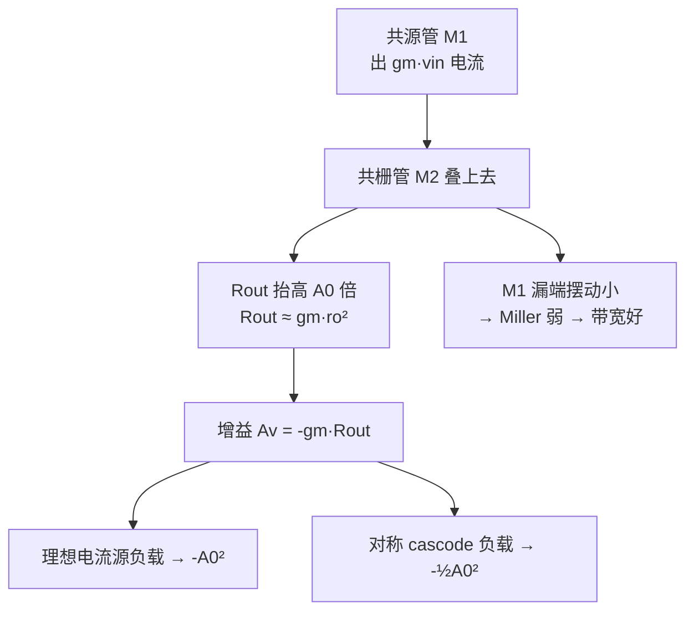

# EE115A 期末复习 — Cascode 放大器（L12）

<aside>
🏗️

**Cascode 放大器（Lecture 12）** — 🔴 必考

一句话：用一个**共栅管**叠在共源管上，把输出阻抗抬高 $A_0$ 倍，从而把增益从 $A_0$ 推到 $A_0^2$，顺带压制 Miller 效应、改善带宽。原始讲义见 [EE115 Lecture12 — Cascode Amplifier](../EE115%20Lecture12%20%E2%80%94%20Cascode%20Amplifier.md)。

</aside>

## 🤔 核心问题

1. cascode 凭什么把增益从 $A_0$ 提到 $A_0^2$？
2. 共栅管把输出阻抗抬到多少？表达式怎么来？
3. 为什么**负载也要 cascode** 才能拿到全增益？
4. cascode 的代价是什么（电压裕度 / 摆幅）？
5. telescopic 与 folded cascode 的区别？
6. cascode 为什么带宽好（抑制 Miller）？

## 🗂 知识点总览

## 📖 详解

### 1. 共栅抬阻抗 🔴

- 共栅管 $M_2$ 叠在 $M_1$ 上，从输出看进去：$R_{out} = r_{o2} + r_{o1} + g_{m2}r_{o2}r_{o1} \approx g_{m2}r_{o2}r_{o1} \approx A_0\,r_{o1}$。
- 物理直觉：流过 $M_2$ 的电流变化经 $r_{o2}$ 反馈到其源极（$M_1$ 漏），$g_{m2}$ 把它「顶回去」，等效阻抗放大 $g_{m2}r_{o2}\approx A_0$ 倍。

### 2. cascode 增益 🔴

- $A_v = -g_{m1}R_{out}$。
- **理想电流源负载**（阻抗 → ∞）：$A_v = -g_{m1}(g_{m2}r_{o2}r_{o1}) = -A_0^2$。
- **对称 cascode 负载**（上下都堆，阻抗也 $\approx g_m r_o^2$）：$R_{out}=(g_m r_o^2)\|(g_m r_o^2)$ → $A_v \approx -A_0^2/2$。

### 3. 为什么负载也要 cascode 🟠

- 若负载只是普通电流源（$R_L=r_o$）：$R_{out}=(g_m r_o^2)\|r_o \approx r_o$ → $A_v\approx -g_m r_o = -A_0$，**cascode 白做**！
- 结论：增益由**两侧阻抗的并联**决定，必须上下都 cascode 才拿到 $A_0^2$ 量级。

### 4. 代价：电压裕度 🟠

- Telescopic cascode 串了更多管，每管要 $V_{DS}\ge V_{OV}$，**输出摆幅缩小**（少了一个 $V_{OV}$ 余量）。
- 还带来**输入共模范围受限**问题 → 引出 folded cascode。

### 5. Telescopic vs Folded 🟡

- **Telescopic**：管子上下串叠，增益 / 功耗最优，但摆幅小、输入输出共模耦合。
- **Folded**：共栅管换相反类型并「折叠」，牺牲一点功耗 / 噪声，换更大摆幅与更宽输入共模范围。

### 6. 带宽优势 🟠

- 共栅级输入阻抗 $\approx 1/g_m$ 很低，把 $M_1$ 漏端电压摆动钳小 → $M_1$ 的 $C_{gd}$ **Miller 倍增被抑制** → 主极点不被拉低，带宽好。这是 cascode 除高增益外的第二大动机。

## 📊 对比表

| 结构 | $R_{out}$ | 增益 $|A_v|$ | 输出摆幅 | 带宽 |
| --- | --- | --- | --- | --- |
| 单管 CS（电流源负载） | $r_o$ 级 | $A_0$ | 大 | 受 Miller 限 |
| Cascode（cascode 负载） | $g_m r_o^2$ 级 | $A_0^2$ | 小（多一个 $V_{OV}$） | 好（抑 Miller） |

## 🧮 公式清单

- 共栅看进输出：$R_{out}\approx g_m r_o^2 = A_0 r_o$
- 理想负载增益：$A_v = -A_0^2$
- 对称负载增益：$A_v \approx -A_0^2/2$
- 共栅看进源极电阻：$R_{in,src}\approx (r_o + R_L)/(1+g_m r_o)\approx 1/g_m$（$R_L$ 小时）

## ⭐ 必背

1. 共栅**抬阻抗** $A_0$ **倍** → $R_{out}=g_m r_o^2$。
2. cascode 增益 $\sim A_0^2$，但**必须上下都 cascode**。
3. 代价 = **摆幅**；好处 = 高增益 + 高带宽（抑 Miller）。
4. 摆幅 / 共模不够 → 用 **folded cascode**。

## ⚠️ 易错汇总

- 只 cascode 一侧就以为能拿 $A_0^2$（被另一侧 $r_o$ 拉回 $A_0$）。
- 忽略输出摆幅缩小。
- 把 $R_{out}$ 当成 $r_o$（实际 $g_m r_o^2$）。
- 混淆 telescopic 与 folded 的取舍。

## 📝 自测题

- 4 道题（点开看解析）
    
    **Q1**（计算）$g_m=1\,\text{mA/V}$、$r_o=100\,\text{k}\Omega$，求 cascode 的 $R_{out}$ 与理想负载下 $|A_v|$。
    
    **Q2**（简答）为什么 cascode 必须负载也堆叠？
    
    **Q3**（简答）cascode 为何带宽优于单管 CS？
    
    **Q4**（判断）folded cascode 主要为了提高增益。对吗？
    
    **A1**：$R_{out}=g_m r_o^2 = 1\text{m}\times(100\text{k})^2 = 10\,\text{G}\Omega$；$A_0=g_m r_o=100$ → $|A_v|=A_0^2=10^4$。
    
    **A2**：增益取两侧阻抗并联；负载若只 $r_o$ 会把总阻抗拉回 $r_o$，增益退回 $A_0$。
    
    **A3**：共栅低输入阻抗钳住 $M_1$ 漏端摆动，抑制 $C_{gd}$ 的 Miller 倍增，主极点不被压低。
    
    **A4**：错。folded 主要为**改善摆幅 / 输入共模范围**，不是提增益。
    

## ⚡ 考前速记

> **「共栅抬阻抗** $A_0$ **倍，两边都堆拿** $A_0^2$**，代价是摆幅，红利是带宽。」**
>