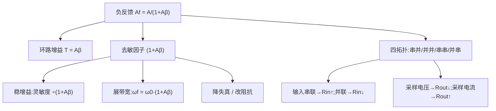

# EE115A 期末复习 — 反馈与运放（L15–L16）

<aside>
🔁

**反馈与运放（Lecture 15–16）** — 🔴 必考

负反馈是模拟设计的「总开关」：用增益换性能 —— 稳增益、展带宽、降失真、改阻抗。叠在两级 CMOS 运放上就是真实芯片。原始讲义见 [EE115 Lecture15 — Feedback 基础与负反馈四大优势](../EE115%20Lecture15%20%E2%80%94%20Feedback%20%E5%9F%BA%E7%A1%80%E4%B8%8E%E8%B4%9F%E5%8F%8D%E9%A6%88%E5%9B%9B%E5%A4%A7%E4%BC%98%E5%8A%BF.md) · [EE115 Lecture16 — Feedback 基础与 Series-Shunt 拓扑](../EE115%20Lecture16%20%E2%80%94%20Feedback%20%E5%9F%BA%E7%A1%80%E4%B8%8E%20Series-Shunt%20%E6%8B%93%E6%89%91.md)。

</aside>

## 🤔 核心问题

1. 负反馈四大好处 + 代价？
2. $A_f=A/(1+A\beta)$ 里环路增益、去敏因子各是什么？
3. **四种反馈拓扑**对应哪种放大器、对 $R_{in}/R_{out}$ 的影响？
4. series-shunt（电压放大器）为何 ↑$R_{in}$、↓$R_{out}$？
5. 反馈怎样展带宽（GBW 守恒）？
6. 两级 CMOS 运放结构 + Miller 补偿？

## 🗂 知识点总览

## 📖 详解

### 1. 负反馈四大好处 🔴

1. **稳定增益**（对 $A$ 漂移去敏）；2. **展带宽**；3. **降非线性失真**；4. **改变** $R_{in}/R_{out}$（外加抑制部分干扰）。
- **代价**：增益下降 $(1+A\beta)$ 倍；环路有延迟 / 多极点时可能**不稳定（振荡）**。

### 2. 基本方程 🔴

- $A_f = A/(1+A\beta)$，环路增益 $T=A\beta$，去敏因子 $(1+A\beta)$。
- 深反馈（$A\beta\gg1$）：$A_f\approx 1/\beta$，几乎只由反馈网络决定。
- 灵敏度：$(dA_f/A_f)/(dA/A) = 1/(1+A\beta)$。

### 3. 四种反馈拓扑 🔴

- **口诀**：输入端**串联**→ $R_{in}\uparrow$，**并联**→ $R_{in}\downarrow$；输出端采样**电压(shunt)**→ $R_{out}\downarrow$，采样**电流(series)**→ $R_{out}\uparrow$。

| 拓扑 | 放大器类型 | $R_{in}$ | $R_{out}$ |
| --- | --- | --- | --- |
| 串-并 Series-Shunt | 电压放大器 $A_v$ | ↑ | ↓ |
| 并-串 Shunt-Series | 电流放大器 $A_i$ | ↓ | ↑ |
| 串-串 Series-Series | 跨导 $G_m$ | ↑ | ↑ |
| 并-并 Shunt-Shunt | 跨阻 $R_m$ | ↓ | ↓ |

### 4. Series-Shunt 细节 🟠

- 采样输出**电压**、输入端**串联**比较电压：
- $R_{in,f}=R_{in}(1+A\beta)$，$R_{out,f}=R_{out}/(1+A\beta)$ → 理想电压放大器（高输入、低输出阻抗）。

### 5. 反馈展带宽（GBW 守恒）🟠

- 单极点 $A(s)=A_0/(1+s/\omega_0)$，闭环 $\omega_f=\omega_0(1+A_0\beta)$。
- 增益带宽积守恒：$A_0\omega_0 = A_f\omega_f$ → 增益降多少，带宽涨多少。

### 6. 两级 CMOS 运放 + Miller 补偿 🔴

- 结构：**第一级** = 差分对 + 电流镜负载（高增益、双转单）；**第二级** = 共源增益级；总 $A=A_1A_2$。
- **Miller 补偿**：在第二级跨接补偿电容 $C_c$，利用 Miller 效应做**极点分裂** —— 主极点压低、次极点推高，换取相位裕度、保证闭环稳定。

## 📊 对比表

| 量 | 开环 | 闭环（负反馈） |
| --- | --- | --- |
| 增益 | $A$ | $A/(1+A\beta)$ |
| 带宽 | $\omega_0$ | $\omega_0(1+A\beta)$ |
| 增益灵敏度 | 1 | $1/(1+A\beta)$ |
| 失真 | 大 | $\div(1+A\beta)$ |

## 🧮 公式清单

- $A_f = A/(1+A\beta)$，$T=A\beta$
- 深反馈 $A_f\approx 1/\beta$
- $R_{in,f}=R_{in}(1+A\beta)$（输入串联），$R_{out,f}=R_{out}/(1+A\beta)$（输出采样电压）
- $\omega_f=\omega_0(1+A\beta)$，GBW：$A_0\omega_0=A_f\omega_f$
- 两级运放 $A=A_1A_2$

## ⭐ 必背

1. $A_f=A/(1+A\beta)$；深反馈 $\to 1/\beta$。
2. 四大好处全靠**去敏因子** $(1+A\beta)$。
3. 拓扑口诀：**串联抬** $R_{in}$**，采压降** $R_{out}$。
4. 两级运放 = 差分级 + CS 级 + **Miller 补偿（极点分裂）**。

## ⚠️ 易错汇总

- 搞反「采样电压 ↓$R_{out}$ / 采样电流 ↑$R_{out}$」。
- 忘了反馈代价是稳定性（多极点会振荡）。
- 把 $A_f$ 当成 $1/\beta$ 而不验证 $A\beta\gg1$。
- 误以为 Miller 补偿降增益（它是移极点、保相位裕度）。

## 📝 自测题

- 4 道题（点开看解析）
    
    **Q1**（计算）$A=10^4$、$\beta=0.1$，求 $A_f$ 与去敏因子。
    
    **Q2**（简答）series-shunt 反馈对 $R_{in}/R_{out}$ 的影响及原因。
    
    **Q3**（计算）开环 $A_0=1000$、$f_0=1\,\text{kHz}$、$\beta=0.1$，求闭环带宽 $f_f$。
    
    **Q4**（简答）Miller 补偿如何保证稳定？
    
    **A1**：$1+A\beta=1+1000=1001$；$A_f=10^4/1001\approx 9.99\approx 1/\beta$。
    
    **A2**：输入串联 → $R_{in}$ 增大 $(1+A\beta)$ 倍；输出采样电压 → $R_{out}$ 减小 $(1+A\beta)$ 倍；即趋近理想电压放大器。
    
    **A3**：$f_f=f_0(1+A_0\beta)=1\text{kHz}\times101=101\,\text{kHz}$。
    
    **A4**：跨接 $C_c$ 做极点分裂，把主极点压低、次极点推高，拉开两极点 → 增大相位裕度 → 闭环稳定。
    

## ⚡ 考前速记

> **「**$A_f=A/(1+A\beta)$**，一个去敏因子换来稳 / 宽 / 净 / 阻四好处；拓扑记口诀，运放靠 Miller 稳相位。」**
>