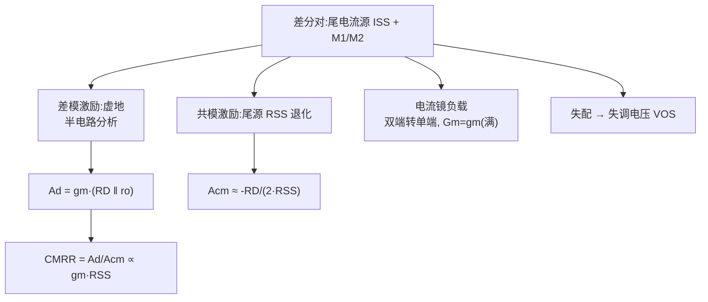

# EE115A 期末复习 — 差分对（L13–L14）

<aside>
⚖️

**差分对 Differential Pair（Lecture 13–14）** — 🔴 必考

模拟 IC 的「心脏级」：用对称结构 + 虚地 + 半电路分析，同时解决**偏置漂移、共模干扰、信号失调**三大问题，并作为运放输入级。原始讲义见 [EE115 Lecture13 — Cascode & Differential Amplifiers](../EE115%20Lecture13%20%E2%80%94%20Cascode%20&%20Differential%20Amplifier.md) · [EE115 Lecture14 — Differential Amplifiers 2](../EE115%20Lecture14%20%E2%80%94%20Differential%20Amplifiers%202.md)。

</aside>

## 🤔 核心问题

1. 为什么模拟 IC 普遍用差分对而非单端？
2. **虚地 + 半电路**怎么用来求差模增益？
3. 差模增益 $A_d$、共模增益 $A_{cm}$、CMRR 各是什么？
4. **电流镜负载**如何双端转单端，并让 $G_m$ 翻倍？
5. 输入共模范围 ICMR 怎么算？
6. 失配如何造成失调电压 $V_{OS}$？

## 🗂 知识点总览

## 📖 详解

### 1. 为什么用差分对 🔴

- **抑共模 / 抗干扰**：共模信号（电源噪声、温漂）两边同相，被尾电流源压制。
- **免大旁路电容**：差分时公共源点是**虚地**，无需大 bypass 电容，省面积、频响好。
- **直接做减法**：天然实现 $v_{id}=v_1-v_2$，是运放输入级。

### 2. 大信号特性 🟡

- 尾电流 $I_{SS}$ 在两管间分配，由 $v_{id}$ 决定。
- 当 $|v_{id}| \ge \sqrt{2}\,V_{OV}$ 时电流几乎全偏一侧（**满摆 / limiting**）。
- 线性范围 $\propto V_{OV}$：要线性大就加大 $V_{OV}$（或源极退化）。

### 3. 差模：虚地 + 半电路 🔴

- 差模激励反对称 → 公共源点电位不动（**虚地**）→ 取**半边电路**分析。
- 电阻负载：$A_d = -g_m(R_D \| r_o)$。
- 电流镜 / 电流源负载：$A_d = -g_m(r_{on}\|r_{op})$。

### 4. 共模与 CMRR 🟠

- 共模时两管同相，公共源点随之动，受**尾源输出电阻** $R_{SS}$ 退化。
- 单端共模增益 $A_{cm}\approx -R_D/(2R_{SS})$（$R_{SS}$ 越大越小）。
- $\text{CMRR} = |A_d/A_{cm}| \propto g_m R_{SS}$ → 关键：**尾源用 cascode 提高** $R_{SS}$ **→ CMRR 升高**。

### 5. 电流镜（有源）负载 🔴

- 把差分双端信号**合成单端输出**，且 $G_m$ 取**满** $g_m$（不是 $g_m/2$）—— 两条支路的信号电流都被镜像汇到输出。
- 单端输出增益：$A_d = g_m(r_{on}\|r_{op})$。这就是 OTA / 运放输入级标准结构。

### 6. ICMR 输入共模范围 🟠

- $V_{ICM,\max}$：受输入管 / 负载保持饱和限制（$V_{ICM,\max}\approx V_{DD}-V_{OV,load}-V_{OV}+V_{tn}$ 量级）。
- $V_{ICM,\min}$：尾源要 $V_{DS,sat}$ + 输入管 $V_{GS}$，约 $V_{ICM,\min}=-V_{SS}+V_{CS}+V_{tn}+V_{OV}$。

### 7. 失调电压 $V_{OS}$ 🟡

- 来自 $\Delta(W/L)$、$\Delta V_t$、$\Delta R_D$ 失配：
- $V_{OS}\approx \Delta V_t + (V_{OV}/2)\,[\Delta(W/L)/(W/L) + \Delta R_D/R_D]$。
- 小 $V_{OV}$ → 小失调，但牺牲线性范围 / 速度。

## 📊 对比表

| 维度 | 差模信号 | 共模信号 |
| --- | --- | --- |
| 公共源点 | 虚地（不动） | 跟随摆动 |
| 分析法 | 半电路 | 带 $2R_{SS}$ 退化的半电路 |
| 增益 | $g_m(R_D\|r_o)$（大） | $R_D/(2R_{SS})$（小） |
| 提升手段 | 电流镜负载 / cascode | 尾源 cascode 抬 $R_{SS}$ |

## 🧮 公式清单

- 差模（电阻负载，单端）：$A_d = -g_m(R_D\|r_o)$
- 差模（有源负载，单端）：$A_d = g_m(r_{on}\|r_{op})$
- 共模（单端）：$A_{cm}\approx -R_D/(2R_{SS})$
- $\text{CMRR}\propto g_m R_{SS}$
- 线性满摆：$|v_{id}|\ge \sqrt{2}\,V_{OV}$
- 失调：$V_{OS}\approx \Delta V_t + (V_{OV}/2)[\Delta(W/L)/(W/L)+\Delta R_D/R_D]$

## ⭐ 必背

1. 差模 → **虚地 + 半电路**；$A_d=g_m(R_D\|r_o)$。
2. 共模增益 $\propto 1/R_{SS}$；**CMRR** $\propto g_m R_{SS}$，尾源 cascode 提 CMRR。
3. **电流镜负载**：双端转单端 + $G_m$ 满 $g_m$。
4. 小 $V_{OV}$ → 小失调，但线性范围变小。

## ⚠️ 易错汇总

- 把电流镜负载的 $G_m$ 当成 $g_m/2$（实际满 $g_m$）。
- 算共模忘了尾源是 $2R_{SS}$ 退化（半电路里）。
- 误以为差分对天生没有失调（失配仍带来 $V_{OS}$）。
- 把虚地当成真正接地节点去算阻抗。
- **PMOS / NMOS 的 S、D 别接反（等效 equivalent circuit 时最常翻车）**：认准**箭头所在的那一极就是源极 S**。PMOS 箭头端通常画在**上方、接** $V_{DD}$ **一侧 → 上面是 S、下面是 D**；NMOS 正好相反，**源极在下方、接地 /** $V_{SS}$ **侧，上面是 D**。画小信号 / 等效电路时严格按这个标 S、D，一旦把 PMOS 的 S、D 弄反，$v_{gs}$、受控源 $g_m v_{gs}$ 和 $r_o$ 连接的节点、以及增益正负号会全部算错。

## 📝 自测题

- 4 道题（点开看解析）
    
    **Q1**（计算）电阻负载差分对：$g_m=2\,\text{mA/V}$、$R_D=10\,\text{k}\Omega$、$r_o$ 很大，求单端差模增益。
    
    **Q2**（简答）差分对为什么不需要大旁路电容？
    
    **Q3**（简答）怎样提高 CMRR？
    
    **Q4**（判断）电流镜负载差分对的有效跨导是 $g_m/2$。对吗？
    
    **A1**：$A_d=-g_m R_D=-2\text{m}\times10\text{k}=-20$。
    
    **A2**：差模激励下公共源点是虚地、电位不动，本就交流接地，无需电容。
    
    **A3**：增大尾电流源输出电阻 $R_{SS}$（用 cascode 尾源），因 CMRR $\propto g_m R_{SS}$。
    
    **A4**：错。电流镜负载把两支路电流都汇到输出，$G_m$ 是**满** $g_m$。
    

## ⚡ 考前速记

> **「差模看半电路（虚地），共模看尾源（**$R_{SS}$**），CMRR 靠** $g_m R_{SS}$**，电流镜负载** $G_m$ **满血。」**
>