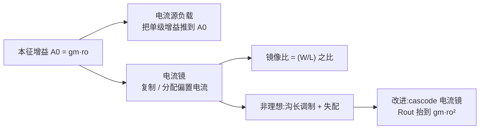

# EE115A 期末复习 — 电流镜 & 本征增益（L11）

<aside>
🪞

**电流镜 & 本征增益（Lecture 11）** — 🟠 重点

从「单管」迈向「IC building block」的第一步：偏置不用电阻而用**电流镜**，负载不用电阻而用**电流源**，单级增益第一次摸到**本征增益** $A_0$ 的天花板。原始讲义见 [EE115 Lecture11 — IC Building Blocks: Current Mirror & Intrinsic Gain](../EE115%20Lecture11%20%E2%80%94%20IC%20Building%20Blocks%20Current%20Mirro.md)。

</aside>

## 🤔 核心问题

1. 为什么 IC 几乎不用大电阻做偏置 / 负载，而用电流镜？
2. 本征增益 $A_0$ 由哪些量决定？为什么与 $I_D$ 一阶无关？
3. 电流镜如何「复制」电流？镜像比由什么决定？
4. 哪些非理想因素让镜像电流不准？怎么改进？
5. 用电流源做有源负载后，CS 级增益变成多少？

## 🗂 知识点总览

## 📖 详解

### 1. 本征增益 $A_0$ 🔴

- **是什么**：单管在**理想电流源负载**（阻抗 → ∞）下能取得的最大电压增益。
- **公式**：$A_0 = g_m r_o = (2I_D/V_{OV})(|V_A|/I_D) = 2|V_A|/V_{OV} = 2V_A' L/V_{OV}$
- **为什么与** $I_D$ **无关**：$g_m \propto I_D$ 而 $r_o \propto 1/I_D$，一阶抵消。
- **怎么提高**：↑ 沟道长度 $L$（$V_A \propto L$）、↓ 过驱 $V_{OV}$；代价是降 $g_m$ / 降速度 / 降摆幅。
- **考法**：给 $V_A, V_{OV}$ 求 $A_0$；问不改 $I_D$ 怎样提增益。

### 2. 基本电流镜 🔴

- **是什么**：参考管二极管接法（$V_{DS}=V_{GS}$ 强制饱和）生成 $V_{GS}$，输出管共栅同压 → 复制电流。
- **镜像比**：$I_O/I_{REF} = (W/L)_2/(W/L)_1$（同 $V_{GS}$、忽略沟长调制）。
- **含沟长调制**：$I_O = I_{REF}\,[(W/L)_2/(W/L)_1]\,(1+\lambda V_{DS2})/(1+\lambda V_{DS1})$
- **输出电阻**：$R_{out} = r_{o2} = 1/(\lambda I_O)$。
- **怎么用**：① 一个 $I_{REF}$ 扇出多路偏置；② 当有源负载。

### 3. 镜像误差来源 🟠

- **沟长调制 /** $V_{DS}$ **失配**：$V_{DS1}=V_{GS}\neq V_{DS2}$ → 主要系统误差。
- **器件失配**：$V_t$、$W/L$ 随机失配 → 随机误差。
- **改进**：**cascode 电流镜**钳住 $V_{DS}$ 且 $R_{out}\approx g_m r_o^2$，精度与阻抗双升（代价：电压裕度）。

### 4. 电流源 / 有源负载 🔴

- CS 管 $M_1$ + 电流源负载（PMOS 镜）$M_2$：$A_v = -g_{m1}(r_{o1}\,\|\,r_{o2})$。
- 若 $r_{o1}=r_{o2}=r_o$ → $A_v = -g_m r_o/2 = -A_0/2$（两 $r_o$ 并联）。这是「单级全摆幅高增益」标准做法。

## 📊 对比表

| 维度 | 电阻偏置 / 负载 | 电流镜 / 电流源 |
| --- | --- | --- |
| 面积 | 大电阻很费面积 | 晶体管紧凑 |
| 偏置精度 | 随工艺 / 温度漂移 | 按尺寸比匹配，稳定 |
| 负载阻抗 | $R_D$ 有限 → 增益受限 | $r_o$ 很大 → 增益逼近 $A_0$ |
| 输出摆幅 | $R_D$ 压降损失大 | 电流源压降小，摆幅好 |

## 🧮 公式清单

- $g_m = 2I_D/V_{OV} = \sqrt{2\mu C_{ox}(W/L)I_D}$
- $r_o = |V_A|/I_D = 1/(\lambda I_D)$
- $A_0 = g_m r_o = 2|V_A|/V_{OV}$
- 镜像：$I_O/I_{REF} = (W/L)_2/(W/L)_1$
- 有源负载 CS：$A_v = -g_m(r_{o1}\,\|\,r_{o2})$
- cascode 镜：$R_{out}\approx g_m r_o^2$

## ⭐ 必背

1. $A_0 = g_m r_o = 2|V_A|/V_{OV}$，**与** $I_D$ **一阶无关**。
2. 镜像比 = **尺寸比** $(W/L)_2/(W/L)_1$。
3. 有源负载单级增益 $\approx -A_0/2$（两 $r_o$ 并联）。
4. 要更高增益 / 阻抗 → **cascode**。

## ⚠️ 易错汇总

- 以为加大 $I_D$ 能提增益（$A_0$ 不变）。
- 忘了输出管必须在**饱和区**镜像才准。
- 把 $-g_m r_o$ 直接当有源负载实际增益（实际是 $-A_0/2$）。
- cascode 提增益但**牺牲输出摆幅**。

## 📝 自测题

- 4 道题（点开看解析）
    
    **Q1**（计算）$V_A=10\,\text{V}$、$V_{OV}=0.2\,\text{V}$，求 $A_0$。
    
    **Q2**（计算）$I_{REF}=50\,\mu\text{A}$、$(W/L)_1=2$、$(W/L)_2=8$，求 $I_O$。
    
    **Q3**（简答）为什么 IC 偏置用电流镜而不用电阻？
    
    **Q4**（计算）有源负载 CS：$g_m=1\,\text{mA/V}$、$r_{o1}=r_{o2}=100\,\text{k}\Omega$，求 $A_v$。
    
    **A1**：$A_0 = 2V_A/V_{OV} = 2\times10/0.2 = 100$。
    
    **A2**：$I_O = 50\,\mu\text{A}\times(8/2) = 200\,\mu\text{A}$。
    
    **A3**：节省面积、偏置随尺寸比精确匹配且抗温漂、提供高阻抗负载使增益逼近 $A_0$、压降小保摆幅。
    
    **A4**：$R_{out}=100\text{k}\|100\text{k}=50\text{k}\Omega$，$A_v=-g_m R_{out}=-1\text{m}\times50\text{k}=-50$。
    

## ⚡ 考前速记

> **「镜像看尺寸比，增益看** $g_m r_o$**，要更高就 cascode。」** 单管增益天花板 = $A_0$；有源负载实际拿 $A_0/2$；电流镜误差主因是 $V_{DS}$ 失配。
>