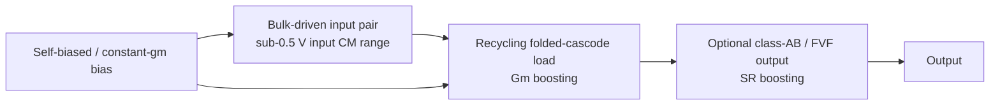

# Proposed idea — Bulk-driven + RFC + Class-AB OTA

<aside>
💡

**Candidate direction：Bulk-driven input + Recycling Folded-Cascode load + optional Class-AB output。**

这不是要真的完成 transistor-level design，而是作为 report 的 “Proposed Idea / Direction” 写半页，展示你能从文献中组合出合理改进方向。

</aside>

## 1. 一句话版本

把 **bulk-driven input pair** 用来解决 sub-0.5 V input headroom；再用 **recycling folded-cascode / current-reuse load** 补偿 bulk-driven 的低 $g_{mb}$；最后可选加 **class-AB output** 改善 slew rate。

## 2. 为什么这个方向合理

### 2.1 Bulk-driven 解决低电源电压

普通 gate-driven differential pair 需要：

$$
V_{DD,\min} \gtrsim V_{TH}+2V_{DSAT}+V_{DSAT,\text{tail}}
$$

当 $V_{DD}$ 降到 0.3–0.5 V 时，threshold voltage 本身就吃掉大部分 headroom，所以 gate-driven input 很难保持 input common-mode range。

Bulk-driven 的做法是：

- gate 端固定 bias，保证 transistor 在合适工作区；
- signal 从 body/bulk 输入；
- input common-mode 不再直接受 $V_{TH}$ 限制。

所以它适合 ultra-low-voltage OTA。

### 2.2 Bulk-driven 的问题：$g_{mb}$ 太小

bulk transconductance 通常只有 gate transconductance 的一部分：

$$
g_{mb}\approx 0.1\text{–}0.3g_m
$$

所以 bulk-driven 虽然解决 headroom，但会带来：

- gain 降低；
- input-referred noise 变差；
- GBW 下降。

### 2.3 RFC / current-reuse 补偿 transconductance

Recycling folded cascode 的核心思想是：让传统 folded cascode 里没有充分参与 signal path 的 current/device 重新贡献 small-signal transconductance。

可以把 proposed core 写成：

$$
G_{m,\text{eff}} \approx (1+k)g_{mb}
$$

其中 $k$ 是 current mirror / recycling path 的增益因子。

这不是精确最终公式，而是写作中用于说明 intuition 的关系：

- bulk-driven 负责低压输入；
- recycling 负责把低 $g_{mb}$ 乘起来；
- 同样 current 下获得更高 GBW / SR。

### 2.4 Class-AB output 解决 slew rate

ultra-low-power OTA 的大信号问题是：

$$
\text{SR}=\frac{I_{\max}}{C_L}
$$

如果只有 tiny quiescent current，SR 会很小。class-AB output 的价值是：

- 静态时 current 很小；
- 大信号时 transient current 增大；
- 用低 quiescent power 换更好的 slew behavior。

## 3. Proposed topology 框图

## 4. 可以直接放进 report 的英文段落

> A possible direction is to combine a bulk-driven input pair with a recycling folded-cascode load. The bulk-driven input stage relaxes the threshold-voltage headroom constraint and enables sub-0.5-V input operation. However, its effective transconductance is limited by the body transconductance $g_{mb}$, which is typically much smaller than the gate transconductance $g_m$. A recycling folded-cascode load can partially compensate for this penalty by reusing current paths that are weakly exploited in the conventional folded-cascode structure, thereby increasing the effective transconductance and improving gain-bandwidth and slew-rate efficiency without a proportional increase in bias current. An optional class-AB output stage may further improve large-signal slew behavior while preserving low quiescent power.
> 

## 5. 注意不要过度声称

写作时避免说：

- “This proposed circuit achieves ...”
- “Simulation shows ...”
- “The new OTA outperforms ...”

因为你没有真的仿真。

应该说：

- “A possible direction is ...”
- “This combination is expected to ...”
- “Qualitatively, this may compensate ...”
- “Further transistor-level design and simulation are required ...”

## 6. 和核心论文的对应关系

| idea component | 对应论文 | 作用 |
| --- | --- | --- |
| bulk-driven input | Blalock 1998；Chatterjee 2005；Kulej & Khateb 2020 | 证明 low-voltage / sub-0.5 V input operation 的可行性。 |
| recycling folded cascode | Assaad & Silva-Martinez 2009 | 证明 current recycling 可以提升 $G_m$、GBW、SR。 |
| class-AB / FVF output | Carvajal 2005；Kulej & Khateb 2020 | 证明 low quiescent current 下可以改善 large-signal behavior。 |
| $g_m/I_D$ design | Silveira 1996；Vittoz 1977 | 作为 low-power bias point 选择的方法论。 |

## 7. 审查重点

只需要判断这件事：

<aside>
✅

这个 proposed idea 是否逻辑自洽：**bulk-driven 解决低压输入，但** $g_{mb}$ **小；RFC / current-reuse 正好补** $G_m$**；class-AB 补大信号 SR。**

</aside>

如果你觉得这个方向太复杂，就降级成：

> **Bulk-driven + class-AB OTA for low-frequency biomedical / wearable sensing**
> 

这个方向更保守，直接由 Kulej & Khateb 2020 支撑。