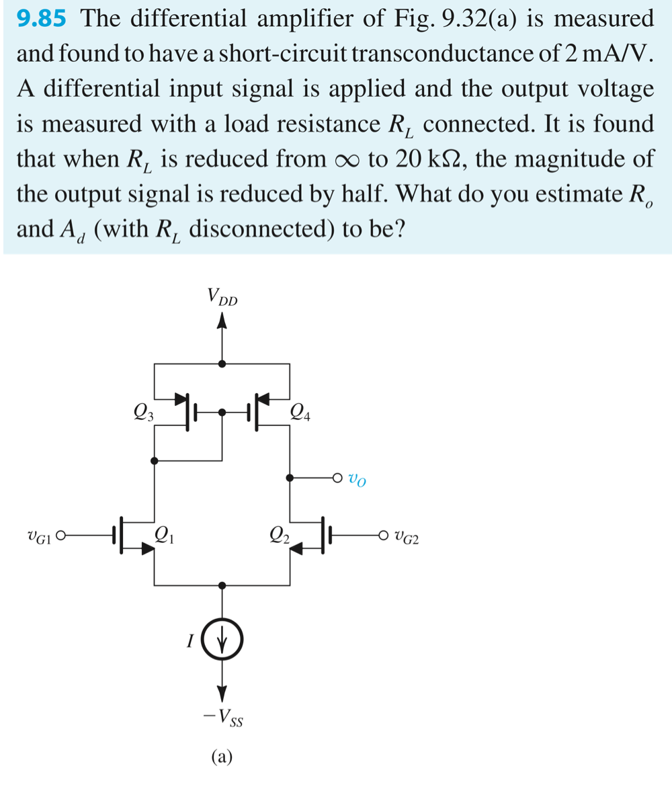
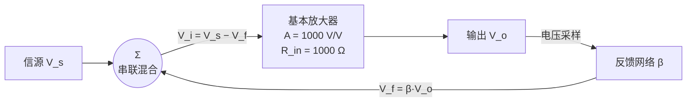

# homework-8

## P1:

### ✍️ 解答

**核心模型**：输出端 = 诺顿等效（固定电流源 $G_m v_{id}$ ∥ 输出电阻 $R_o$），故

$v_O=G_m v_{id}\,(R_o\|R_L)$

已知短路跨导 $G_m=2\ \text{mA/V}$。

**Step 1｜由「输出减半」定** $R_o$

- $R_L=\infty$：$v_{O1}=G_m v_{id}\,R_o$
- $R_L=20\ \text{k}\Omega$：$v_{O2}=G_m v_{id}\,(R_o\|R_L)$
- 减半条件：$\dfrac{v_{O2}}{v_{O1}}=\dfrac{R_o\|R_L}{R_o}=\dfrac12$ ⟹ $R_o\|R_L=\dfrac{R_o}{2}$ ⟹ $R_L=R_o$
- 所以 $R_o=R_L=20\ \text{k}\Omega$（两个相等电阻并联恰好减半）

**Step 2｜开路差分增益** $A_d$

$A_d=G_m R_o=2\ \text{mA/V}\times20\ \text{k}\Omega=40\ \text{V/V}$

<aside>
✅

**答案**：$R_o\approx20\ \text{k}\Omega$，$A_d=G_m R_o\approx40\ \text{V/V}$（约 32 dB）。

</aside>

## P2:

### ✍️ 解答

> 思路确认：**k →** $g_m$ **→** $r_o$**（由** $I,V_A$**）→** $A_d$**（由** $g_m,r_o$**）** 这条链完全正确 ✅。两个执行细节别漏：每管电流是 $I_D=I/2$，且 $V_A=V_A'\cdot L$。
> 

**已知**：$I=200\ \mu\text{A}$，$L=0.5\ \mu\text{m}$，$(W/L)_{1,2}=50$，$\mu_n C_{ox}=200\ \mu\text{A/V}^2$，$|V_A'|=5\ \text{V/μm}$。

每管偏置电流 $I_D=I/2=100\ \mu\text{A}$。

**① 跨导** $g_{m1,2}$

$k_n=\mu_n C_{ox}(W/L)=200\times50=10^4\ \mu\text{A/V}^2$

$g_{m1,2}=\sqrt{2k_n I_D}=\sqrt{2\times10^4\times100}\ \mu\text{A/V}\approx1.41\ \text{mA/V}$

**② 输出电阻** $r_{o2}$**、**$r_{o4}$

$V_A=V_A'\cdot L=5\times0.5=2.5\ \text{V}$（$Q_2,Q_4$ 同 $L$、同 $I_D=100\ \mu\text{A}$）

$r_{o2}=r_{o4}=\frac{V_A}{I_D}=\frac{2.5}{100\ \mu\text{A}}=25\ \text{k}\Omega$

**③ 差分增益** $A_d$

$A_d=g_{m1,2}\,(r_{o2}\|r_{o4})=1.41\ \text{mA/V}\times12.5\ \text{k}\Omega\approx17.7\ \text{V/V}$

<aside>
✅

**答案**：$g_{m1,2}\approx1.41\ \text{mA/V}$，$r_{o2}=r_{o4}=25\ \text{k}\Omega$，$A_d\approx17.7\ \text{V/V}$（约 25 dB）。

</aside>

## P3:

### ✍️ 解答

**电路识别**：非反相放大器 + 电阻分压反馈 = **Series-Shunt（电压-电压）负反馈**；运放输入电阻 ∞、输出电阻 0、开环增益 $A$ 有限。核心公式 $A_f=\dfrac{A}{1+A\beta}$。

**(a) 反馈系数** $\beta$

反馈网络把输出 $V_o$ 经 $R_2$–$R_1$ 分压，取 $R_1$ 上电压送回反相端：

$V_f=V_o\dfrac{R_1}{R_1+R_2}\ \Rightarrow\ \beta=\dfrac{V_f}{V_o}=\dfrac{R_1}{R_1+R_2}$

（理想闭环 $1/\beta=1+R_2/R_1$。）

**(b) 求** $R_2$ **使** $A_f=10$

由 $A_f=\dfrac{A}{1+A\beta}$ 反解 $\beta=\dfrac{1}{A_f}-\dfrac{1}{A}$，再 $R_2=R_1\left(\dfrac1\beta-1\right)$，$R_1=10\ \text{k}\Omega$：

| 情形 | $A$ | $\beta=\tfrac1{A_f}-\tfrac1A$ | $1/\beta$ | $R_2$ |
| --- | --- | --- | --- | --- |
| (i) | 1000 | 0.099 | 10.10 | $\approx 91.0\ \text{k}\Omega$ |
| (ii) | 200 | 0.095 | 10.53 | $\approx 95.3\ \text{k}\Omega$ |
| (iii) | 15 | 0.0333 | 30 | $290\ \text{k}\Omega$ |

**(c)** $A$ **下降 20% 时** $A_f$ **的变化**

精确算 $A_f'=\dfrac{0.8A}{1+0.8A\beta}$，变化率 $\delta=\dfrac{A_f'-A_f}{A_f}$；关键看去敏因子 $1+A\beta$：

| 情形 | $1+A\beta$ | $A_f:\ A\to0.8A$ | $\Delta A_f/A_f$ |
| --- | --- | --- | --- |
| (i) | 100 | $10\to9.975$ | $-0.25\%$ |
| (ii) | 20 | $10\to9.877$ | $-1.23\%$ |
| (iii) | 1.5 | $10\to8.571$ | $-14.3\%$ |

<aside>
🧠

**结论**：环路增益 $A\beta$（去敏因子 $1+A\beta$）越大，$A_f$ 对开环 $A$ 越不敏感。(i) $A\beta=99$，$A$ 掉 20% 只引起 $-0.25\%$；(iii) $A\beta=0.5$ 太小，几乎无去敏效果，$A_f$ 跟着掉 $-14.3\%$。这正是负反馈「用富余开环增益换闭环增益稳定性」的本质，也呼应灵敏度公式 $\dfrac{dA_f/A_f}{dA/A}=\dfrac{1}{1+A\beta}$。

</aside>

## P4:

### ✍️ 解答

**电路同 P3**：非反相 Series-Shunt 负反馈，$A_f=\dfrac{A}{1+A\beta}$。**去敏因子（desensitivity factor）** $D=1+A\beta=\dfrac{A}{A_f}$，目标 $A_f=10$。

**① 两种设计的** $\beta$ **与去敏因子**

| 设计 | $A$ | $D=1+A\beta=A/A_f$ | $A\beta$ | $\beta$ |
| --- | --- | --- | --- | --- |
| ① | 1000 | 100 | 99 | 0.099 |
| ② | 500 | 50 | 49 | 0.098 |

**②** $A=1000$ **单元有 ±10% 增益不确定度 → 闭环不确定度**

$\frac{\Delta A_f}{A_f}=\frac{1}{1+A\beta}\cdot\frac{\Delta A}{A}=\frac{\pm10\%}{100}=\pm0.1\%$

**③ 用** $A=500$ **达到同样的** $\pm0.1\%$ **→ 允许的最大开环不确定度**

去敏因子只有 50，反推：$\dfrac{\Delta A}{A}=\pm0.1\%\times50=\pm5\%$。

<aside>
✅

**答案**

- $A=1000$：$\beta=0.099$，去敏因子 $=100$；开环 ±10% → 闭环 $\pm0.1\%$。
- $A=500$：$\beta=0.098$，去敏因子 $=50$；要达到同样 $\pm0.1\%$，开环增益不确定度最多 $\pm5\%$。
- **直觉**：去敏因子越大越「抗漂移」，所以高开环增益的设计 ① 对管子精度要求更松。
</aside>

## P5:

### ✍️ 解答

**电路**：series-shunt（电压-电压）负反馈，两级共源 $Q_1,Q_2$；反馈网络 $R_1$（$V_f$ 到地）+ $R_2$（$V_o$ 回授到 $Q_1$ 源端）。$\beta=\dfrac{R_1}{R_1+R_2}$，$A_f=\dfrac{A}{1+A\beta}$（实际闭环），理想 $A_f\approx1/\beta=1+R_2/R_1$。

**(a) 设计** $R_2$**（理想** $A_f=5$**）**

$\dfrac1\beta=1+\dfrac{R_2}{R_1}=5\Rightarrow R_2=4R_1=4\ \text{k}\Omega$，对应 $\beta=0.2$。

**(b) 求** $A\beta$ **与实际** $A_f$

条件：$g_{m1}=g_{m2}=4\ \text{mA/V}$，$R_{D1}=R_{D2}=10\ \text{k}\Omega$，$r_o\to\infty$。

**方法（精确）：断环求环路增益** $A\beta\equiv-V_r/V_t$**（Example 11.2 的表达式）**

$A\beta=(g_{m1}R_{D1})(g_{m2}R_{D2})\cdot\dfrac{1}{1+g_{m1}R_1}\cdot\dfrac{R_1}{R_{D2}+R_2+(R_1\|1/g_{m1})}$

反馈电压回到 $Q_1$ 源极时，源极对地呈现 $1/g_{m1}=0.25\ \text{k}\Omega$，与 $R_1$ 并联分流，所以分压里是 $R_1\|\tfrac1{g_{m1}}$ 而非单纯 $R_1$。代入：

- $g_{m1}R_{D1}=g_{m2}R_{D2}=40$，$\dfrac{1}{1+g_{m1}R_1}=\dfrac{1}{1+4}=0.2$
- $R_1\|\tfrac1{g_{m1}}=1\|0.25=0.2\ \text{k}\Omega$，分母 $=10+4+0.2=14.2\ \text{k}\Omega$
- $A\beta=40\times40\times0.2\times\dfrac{1}{14.2}=\dfrac{1600}{71}\approx22.54$

闭环（理想 $A_{f\infty}=1+R_2/R_1=5$）：$A_f=A_{f\infty}\dfrac{A\beta}{1+A\beta}=5\times\dfrac{1600/71}{1671/71}=\dfrac{8000}{1671}\approx4.79\ \text{V/V}$

<aside>
⚠️

**为什么和「双口 A–β 分离法」不同**：若按双口法取 $\beta=\dfrac{R_1}{R_1+R_2}=0.2$、第一级退化取 $R_1\|R_2=0.8\text{k}$、输出负载 $R_{D2}\|(R_1+R_2)$，会得到 $A\approx126.98$、$A\beta\approx25.40$。那是**近似**：它把反馈网络当成单向，且忽略了 $Q_1$ 源极电阻 $1/g_{m1}=250\,\Omega$ 对反馈分压的负载。由于 $1/g_{m1}$ 与 $R_1=1\text{k}$ 可比，近似误差约 13%。题目要求「用 Example 11.2 推导的表达式」，故以**断环环路增益** $A\beta\approx22.54$ 为准。

</aside>

<aside>
✅

**答案**

- (a) $R_2=4\ \text{k}\Omega$（$\beta=0.2$）。
- (b) 精确断环：$A\beta=\dfrac{1600}{71}\approx22.54$，$A_f\approx4.79\ \text{V/V}$；双口近似法则给 $A\beta\approx25.40$。
- 实际 $A_f$ 比理想 5 低约 4%，因为环路增益 $A\beta$ 有限（去敏因子 $1+A\beta\approx23.5$）。
</aside>

## P6:

### 📐 双口模型图解（A 电路 + β 电路）

这张图就是上面框图的「电路化」版本：灰色 = **A 电路**（基本放大器），蓝色 = **β 电路**（反馈网络）。符号对应如下：

| 图中符号 | 含义 | P6 数值 |
| --- | --- | --- |
| $R_i$（灰色 A 电路内、$V_i$ 两端） | 放大器**本体**输入电阻 | $R_{in}=1\ \text{k}\Omega$ |
| $AV_i$ | 受控电压源（开环增益） | $A=1000$ |
| $R_o$ | 放大器输出电阻 | 本题没用 |
| $\beta V_o$（蓝色 β 电路） | 反馈电压源 | $\beta=0.009$ |
| $R_{if}$（最左 S–S′ 往里看） | **闭环**输入电阻 | $10\ \text{k}\Omega$（题目给） |
| $R_{of}$（最右 O–O′） | 闭环输出电阻 | 本题没问 |

<aside>
🎯

**你问的两个点**

- $R_i$ **是什么**：图里灰色 A 电路框内、$V_i$ 两端那个电阻，是**放大器自己**的输入电阻（不含反馈）。对应 P6 的 $R_{in}=1\ \text{k}\Omega$。
- **closed-loop input 是哪个电阻**：是图**最左边** S–S′ 端口、蓝色箭头标的 $R_{if}$——从信号源 $V_s$ 往整条反馈环里看进去的输入电阻，$=10\ \text{k}\Omega$。
- **两者关系**（series mixing 抬高输入电阻）：$R_{if}=R_i(1+A\beta)$。把 $1\text{k}\to10\text{k}$ 代入即得 $1+A\beta=10$。
</aside>

### ✍️ 解答（框图级，无 R1/R2）

<aside>
🧩

**先纠正一个预期**：P6（Prob 11.37）是**抽象框图题**，题面只给「基本放大器」的 $A$、$R_{in}$ 和闭环 $R_{if}$，**没有 P3/P5 那种具体的** $R_1$**、**$R_2$ **分压电阻**。所以 $\beta$ 不是从电阻读出来的，而是用输入电阻公式**反推**出来的一个纯比值。

</aside>

**反馈结构框图**

**① 判定反馈类型**

- 输出端：题目说 "voltage sampling"（电压采样）→ 输出**并联**取样，会**降低**输出电阻。
- 输入端：闭环输入电阻 $R_{if}=10\text{k}\Omega$ 比 $R_{in}=1\text{k}\Omega$ **变大** 10 倍 → 一定是**串联混合**（series mixing 才抬高输入电阻）。
- 合起来 = **Series-Shunt（电压-电压）负反馈**，和 P3/P5 同类，只是这里不画具体电路。

**② 用输入电阻公式反推** $A\beta$

串联混合把输入电阻放大 $(1+A\beta)$ 倍：

$R_{if}=R_{in}(1+A\beta)$

$10\ \text{k}\Omega = 1\ \text{k}\Omega\,(1+A\beta)\ \Rightarrow\ 1+A\beta=10\ \Rightarrow\ A\beta=9$

（顺带 $\beta=A\beta/A=9/1000=0.009$。）

**③ 闭环增益**

$A_f=\dfrac{A}{1+A\beta}=\dfrac{1000}{10}=100\ \text{V/V}$

**④ 若改成单位增益缓冲器（**$A_f=1$**）**

「单位增益」指的是**闭环** $A_f=1$。去敏因子用**精确关系** $1+A\beta=\dfrac{A}{A_f}=\dfrac{1000}{1}=1000$（**不要**近似成 $\beta\approx1$）：

$R_{if}=R_{in}(1+A\beta)=R_{in}\dfrac{A}{A_f}=1000\times1000=1.0\ \text{M}\Omega$（精确值）

（此时真正的反馈系数 $\beta=\dfrac{1}{A_f}-\dfrac{1}{A}=1-0.001=0.999$，并非整 1；若硬取 $\beta=1$ 得 $1+A\beta=1001$，那才是近似。）

<aside>
✅

**答案**

- 闭环增益 $A_f=\dfrac{A}{1+A\beta}=100\ \text{V/V}$（因为 $R_{if}=R_{in}(1+A\beta)\Rightarrow A\beta=9$）。
- 单位增益缓冲器（$A_f=1$，精确）：$1+A\beta=A/A_f=1000$，故 $R_{if}=R_{in}(1+A\beta)=1000\times1000=1.0\ \text{M}\Omega$。
</aside>

**和 P5 的对应关系（为什么 P6 没有 R1/R2）**

| 角色 | P5（具体电路） | P6（抽象框图） |
| --- | --- | --- |
| 基本放大器 $A$ | 两级共源 $Q_1,Q_2$ | 直接给 $A=1000$ |
| 反馈系数 $\beta$ | $\dfrac{R_1}{R_1+R_2}=0.2$ | 反推得 $0.009$（无 $R_1,R_2$） |
| 输入电阻 $R_{in}$ | $Q_1$ 栅极（理想 ∞） | 直接给 $1\text{k}\Omega$ |
| 闭环输入电阻 | $R_{in}(1+A\beta)$ | 给 $10\text{k}\Omega$，用来求 $A\beta$ |